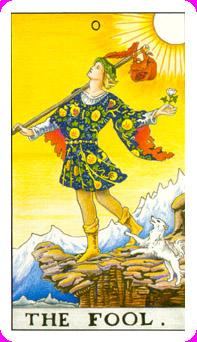

# 愚者

新王贺鲁斯，而这张又是水瓶世纪的主导者，衣服上的符号又代表卡巴拉的皇冠，为什幺是愚者，因为他不知道她不知道他背包里面的东西，他不晓得怎幺去运用而是乐观的去面对所有的事态，对于冒险的东西都乐观去面对处理。这个人必须开始去尝试去冒险才会长进，这条狗是在警告它的危险性，狗代表纯洁和良善，他从圣山下来。由于刚下山完全不知道人间险恶，权杖会化为摩西的法杖，包袱里装的神秘，桂冠代表着荣耀，在罗马位阶高的人才能戴。

羽毛代表出发，其中死神代表死，太阳代表生

葡萄藤旁边有果实葡萄，酿酒之神，酒神戴奥尼修斯，代表就是爱玩、不知天高地厚没有分寸，红白衬衫，白色代表百合，红色代表玫瑰，白色代表纯洁，红色代表热情。

靴子的黄色和地上的黄色结合在一起即是与人间融合，他把圣山上所有的智慧带下来，融入人间。在马赛塔罗里面，狗会咬着他，叫做欺负流浪者

PS:鳄鱼的眼泪又代表最大的谎言

天王星的代表，荷鲁斯(Horus)埃及的法老王，代表旅游、快乐、不知天高地厚的勇气，圣山代表着天外天，不代表耶稣们而是代表造物主，从双鱼世纪来到水瓶，可是他不知道他责任重大，他把这摩西的权杖用来挂东西而不支魔杖的强大法力，包袱里面的果实就是秘密，也就是塔罗牌的奥义。从圣山里面下来，从身上的几个特征得到。在希腊罗马神话里面代表酒神戴奥尼修斯(Dionysus)，酿的酒太美味了导致众神都不认真工作，宙斯一气之下将他打入凡间。纯净的内在，外在的热情，思想纯真毫无邪念，将上帝的东西带下来，鞋子原本不是黄金色的，新的事物到了一个新的地方都需要和周遭去磨合或同合，就是炼金术中的共融概念。这只狗警告的意味，愚者不知到身处环境的危险，他只是积极的想要和人世间共融。带着桂冠叶就是尊荣的状态，白百合和红玫瑰整合成一体的状态就是手上的东西。这两个分别代表纯净与热情。头上的羽毛是证据象征，死神头上也有红羽毛，太阳牌也是，分别代表着诞生、成长、死亡。去冒险尝试。

逆位: 冒昧、不知进退，旅游成为了离开。他只剩下破坏力，本来好好的事情过于冲动而导致失败。