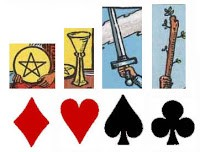
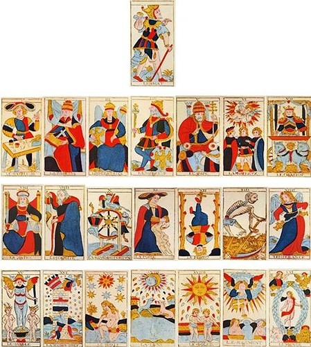
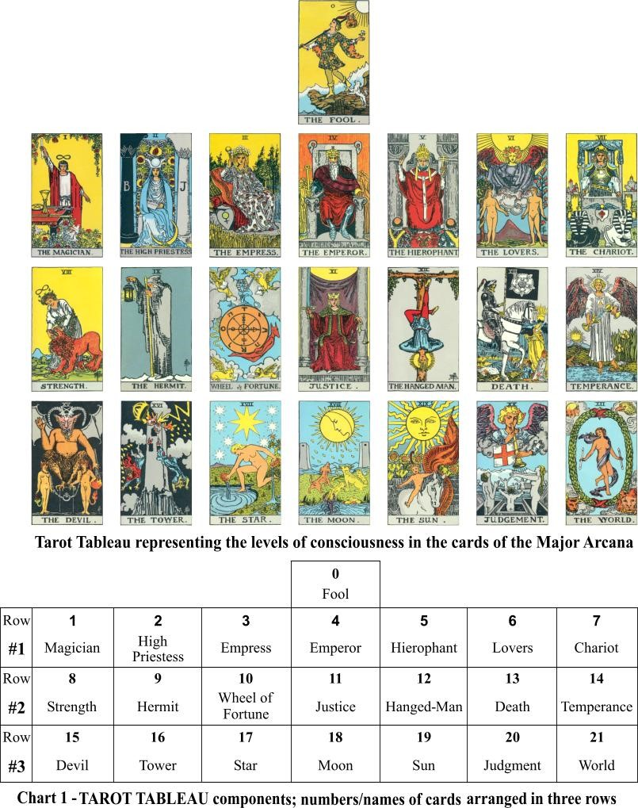

# 基本知识

塔罗牌涵盖埃及、北欧、罗马、希腊、印度、犹太神话
魔法师在各个神话代表:埃及(托特)、北欧(世界中柱、希腊(阿波罗)、罗马(魔法师)

塔罗牌拥有三法(功法、疗法、魔法)和三术(炼金术、占星术、卡巴拉术)

伟特塔罗融合了：希腊、罗马、埃及、北欧、卡巴拉、占星、炼金、灵数

塔罗牌一共78张其中22张大牌为大阿尔克纳56张小牌为小阿尔克纳
身:1~7 心:8~14 灵:15~21 其中0愚者则结合身心灵

四组元素

- 火:梅花14-1=13

- 水:爱心14-1=13

- 风:黑桃14-1=13

- 土:方块14-1=13

  侍者牌变成鬼牌
  四种元素的侍者:新讯息 新工作 新感情 新价值观

塔罗牌的52张代表着一年的52周
皮肤称为土、血液称为水、吐气称为风、体温称为火，合称为有机质。自然界的一直皆是需要这些物质来组成。

为什么塔罗牌会准?
因为它结合了荣格心理学，荣格把神话和不科学的东西做研究，称为集体浅意识。而塔罗牌就是这个代表。除此之外还可以透过阿卡夏纪录(Akashic records)天书，来加深了解自己的前生今世。

## 马赛塔罗

古塔罗(马赛)于16世纪盛行，而威斯康提是当时于宫廷王族在使用的牌，这也是马赛牌的前身，而且当时有80张但是传到凡间则变成78张也就是马赛牌。

当时传到罗马教廷耳边，他们禁止人们算命，教廷称之马赛为邪教，透过马赛牌来占卜或者医疗的人都被称为异教徒。而现今最大宗则是伟特与托特。

塔罗牌在16世纪，这300~400年间，伟特把这些神学的东西融合在现在的通用塔罗上面，这副牌上面有三法三术。

- 三法：魔法、疗法、功法
- 三术：密术、炼术、占星术

马赛是16~19世纪，相较位伟特较简单，因为伟特历经了太多时代，因此每张牌里面都会有相当的故事。

## 伟特塔罗

莱德伟特，作者伟特于1903年绘制1910年出版，又称为现代塔罗，区别现在塔罗与古典塔罗(上述插图)差别在8号牌和11号牌，现代8对应星座狮子座，他把星座的概念带进去。

在19世纪占星术的导入，使得马赛牌的8号牌正义在伟特时的因为占星术则改成力量牌，正好和马赛牌的11号牌对调。

由上图 可知愚者为0的代表，在卡牌游戏中的鬼牌也是没有数值的。
愚者可被视为尚未达到境界的精神灵魂，他正在开始走向灵魂之旅，只有当灵魂或生命到达人类的阶段，他才可以知道真正的神源。

塔罗大牌分为三组，每组七张牌的结构中对应了柏拉图的灵魂三部分

* Row#1: THE CHIEF PRINCIPLES OF CONSCIOUSNESS
  * 第一部分是关于力量、声望、肉欲、爱情，对应欲望的灵魂。
* Row#2: THE CHIEF LAWS OF CONSCIOUSNESS AND OF THE UNIVERSE
  * 第二部分是关于时间、死亡、和美德，这些代表了英雄的斗争，对应意志的灵魂。
* Row#3: THE CONSEQUENCE OF YOUR USING THOSE LAWS
  * 第三部分则是由坏（魔鬼）到好（世界）的提升，对应理性的灵魂，由此上升到神秘学的目标。

整个过程表达了灵魂从低层次逐渐发展至高层次的启迪，这是一种向高层智慧提升的灵魂之旅。

塔罗三德: 力量、正义、节制
1903年 伟特曾经说过要怎么去平衡这些实务的成果，产生的作用是不是大家都能够互惠。

- 力量: 主轴-制衡
- 正义: 主轴-原则
- 截至: 主轴-作用

1850年 四德: 力量、正义、节制、隐者
因为隐者的存在会影响到另外三个的存在，隐者本身的涵义也包含再力量、正义、节制里面。

7天造世界，对基督教而言7是一个神秘数字，7也是天使
抹大拉玛丽亚的力量大于耶稣，耶稣和13个门徒吃饭，靠近耶稣的使徒，最接近那个就是玛丽亚，也就是她把水便酒使耶稣复活。

抹大拉玛莉亚: 女神概念，指的是耶稣的老婆，耶稣俱备神通，但是老婆更具实力，将水或者是东西变成食物，据说耶稣死后复活也是玛丽亚的神力。

| 七原罪                                | 七美德                               |
| ------------------------------------- | ------------------------------------ |
| 路西法（Lucifer）：傲慢（Pride）      | 谦逊（Humility）[ 正义（Justice）]  |
| 玛门（Mammon）：贪婪（Greed）         | 慷慨（Charity）                      |
| 阿斯莫德（Asmodeus）：淫欲（Lust）    | 贞洁（Chastity）[ 诚信（Faith）]|
| 萨麦尔（Samael）：暴怒（Wrath）       | 耐心（Patience） [ 勇敢（Fortitude）] |
| 别西卜（Beelzebub）：贪食（Gluttony） | 节制（Temperance）                   |
| 利维坦（Leviathan）：妒忌（Envy）     | 宽容（Kindness）                     |
| 贝尔芬格（Belphegor）：懒惰（Sloth）  | 勤奋（Diligence）[ (希望（Hope）]    |

2000年以后又称为水瓶世纪，靠创意取胜
公元前和公元后，以2000年为一纪，现在正是双鱼纪的魔法时代，信仰所得到的新认知，按部就班就会有所得。2000以后开始都进入水瓶世纪，以创意为主轴，所有的东西都在变化，跟着时代一起转才会成功，旧的全部抛去引入心的概念和思维，气场的变化速度之快，不再是稳定的状态。

### 愚者之旅
愚者之旅的开始，先是哥哥、姊姊、妈妈和爸爸，进入学校后遇见老师。在学校里面谈了小恋爱。准备毕业的时候充满着自信，进入社会后充满斗志。社会开始考验你的耐力和实力，同时也考验你的内在欲望。遇见老人，他告诉你事情该如何进行和如何防范灾难。一个好的契机点或机会点让你能够升官。但是你必须做出正常的判断和付出。同时你对公司还要无所怨言的付出，牺牲奉献的精神。有时候感觉疲倦想要抛下一切。最后终于达到想要的职位。随着带来的是物质上的诱惑，权力、金钱、情色都随之而来，究竟该如何做选择？在其中沈溺久了后，感到厌恶想获得宁静，将一切破坏。享受心灵上的安静。找到自身内在最大的恐惧。找到成功是什么并将其定义。提升自我的灵性，拯救周遭你可以帮助的任何人。得到内心真正的自在，成功不是代表物质而是与心灵的结合点。
