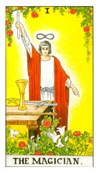

# I.魔法师

手上拿的是第五元素乙太子，头顶上的符号代表无限，白袍代表纯洁，红色代表热情，这条衔尾蛇，他把自己的尾巴咬起来，能量能够自寻循环，所谓的再生，不需要外来的能量，代表医疗之神，有人说魔法师也代表太阳神阿波罗。

汞和硫的结合体为贤者之石，权杖代表火元素，宝剑代表风元素，圣杯代表水元素，金币代表土元素，这个人的眼神很深邃代表它是也是无限宽广

医疗的概念，太阳神阿波罗(Apollo)，蛇是重生的概念，因为他会脱皮他可以自我疗育，衔尾蛇的概念是源源不绝的，以太是虚的一个光的型态而非实务，杖、剑、杯、币，这四个能量的融合，功法的运行状态，特别的呼吸方式在练习，白边代表着水蒸汽，一种疗愈的状态，运转的模式。代表着水星，代表聪明俱有智能和逻辑性，8字符号代表着无限大的模式，8这个数值之前是无限大的代称，在8在基督教的概念里面代表着重生，不断的再呈现变化的模式。在爱情里面他正在执行救世的任务，他很有才华，可是他不会单单待在一个女生的身旁，他会不断的成长，男生生命特点不会只有爱情还有更多，他会不断成长因此女生也需要不断的成长才能匹配。才华洋溢的男性，思维和创造力都非常的强，在工作或者是其他方面都是非常的旺盛。在医疗抽到这张代表这医生非常优秀。

逆位: 表里不一，他只是虚有其表，对事物的理解清楚但只是半桶水响叮当，也可能代表着骗子，最容易欺骗女生。毫无自知之明，自觉性很差。

神话轶闻:
在希腊神话中登场的河神拉顿(Ladon)的女儿达芙妮(Daphne)，宁芙(Nymph)女神之一。太阳神阿波罗爱上了她，对她展开了热烈的求爱并不断地追赶她。惊慌逃走的她向父亲求救，在阿波罗即将追上她的一刹那，河神把她变成了一株月桂树。伤心的阿波罗从月桂树上折下一根枝条，编成一个花环戴在头上。从此之后，月桂树就被称作「达芙妮」，属于太阳神阿波罗的神树。