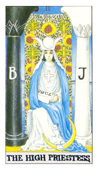

# II.女祭司

具有预言的能量，天上与地上之间的桥梁，本身女祭司是月亮的代表人物，如果愚者是小孩，魔法师是哥哥，女祭司便是姊姊，住在圣殿，唯一的伴侣和情侣就是书籍，没事就在钻研经典，这本经典就是律法之书，也代表摩西五经，创世记、出埃及记、利未记、民数记、申命记，出走的地方就是以色列。
套用在卡巴拉三角形中黑柱子(严厉)和白柱子(慈悲)代表是非，因为女祭司是圣女所以纯洁，她站在中间代表她正在调和，是个力道的整合者。后面的火龙果是石柳又属阴，具有自我养护的功能，完全与世隔绝，衣服的蓝和白，蓝色代表海的宽广无际，代表潮汐的变化彭派的力量。头冠的部分就是结晶的所在称之为贤者之石的所在。十字架代表阴跟果就是过去和未来，脚代表力量，原形是灵性，实际是物质。
括棕树代表阳性物，阳者生阴，阴者生阳，女祭司坐在中间做调和。同时女祭司也代表着水星。右手藏在律法之书里面，代表她随时在变法。

月亮有阴晴圆缺的变化，这是一个上弦月
月亮有月亮28分，经期可以跟着月亮走，初1~7可以尽情吃东西，8可以吃更多，9~15不要吃太多，所吃的东西热量都会倍数计算，15之后开始转为高纤，上半月补下半月排毒，可以调整女性经期，此方法为女巫的方法。

从柱子看出这不是基督的圣殿，是女神的圣殿，注意柱子的上端，在柱子的外面有胜利骑士，守护着女祭司。
R代表莱德，W代表伟特，R代表史密斯小姐。

智慧女神Sophia，严厉与慈悲代表着这两个黑白柱子，对与错，她是中间的调和者，她处在圣殿，抹大拉玛莉亚(Mary Magdalene)的所带地。石柳是补血用的，营养可以自行充足，新生之力。胸前的十字架代表物质的模式，她超越了物质的模式。手上的经典是律法之书TORA，塔罗来说应该是5个字第5个字就是秘密的所在，这本书也是摩西五经，创世纪、出埃及纪、民数纪、利末纪、申命纪。上面神圣的力量传导下来该由她来宣布。她是女神概念里面的处女，守着少女原型的概念。利于求学、增长知识，但是不利于感情，对感情是绝缘的。不容易融入别人的生活模式，对于交谊的模式比较疏远，应该要加强与人交流的模式。代表行星月亮。

逆位: 思春少女，小鹿乱撞，愿意试试看去改变之前的生活模式，想要接受新的概念或者是思维。从自己的领域或象牙塔走出来接触人群。再学习里面代表坐不住，没办法静下心来好好学习。

延伸阅读:
教皇: 出了社会到了灰色的概念，没办法在二元论，所有事物的接纳与融洽度变高，人性的教化，引导与教导，一个长辈者与指导者。 

正义: 审判，不接受劝化或者是教化，只好接受审判，用一个法律的部分来进行判决。