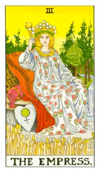

# III.皇后

处在麦田里面，皇后代表丰富和丰收，爱心抱枕上的符号代表金星，有脚就是水星符号，因为有理智的时候最容易发生冲突，把脚拿叫就是灵性和物质的整合就是爱情的状态，头上有12颗星星代表黄道12宫，代表她可以孕育很多人就像妈妈一样。手上握着权杖代表权力的中心，河流代表生命之水，人间的伊甸园。身上穿的是睡袍，所以她在休息状态，正处在一个很轻松的状态，衣服上的图案是石柳，补血的石柳，女祭司的石柳是挂在树上面，皇后则不是，她是镶嵌在身上，因此她更加体健更完整，这张牌代表稳定，富足。皇后具有温柔体贴还要将智慧隐藏起来，后面有红色抱枕代表她具有强大的热情，后面有咖啡色的抱枕，上面有金星的符号代表她拥有强大的爱意，隐藏的爱情爱意，她正在控制当中，一国之母不可乱来。

希腊神话中狄蜜特(Demeter)丰饶女神与大地女神的代表，背后的幼发拉底河就是代表生产与生殖，头上的星星代表着黄道十二宫，这12个都是从她诞生的，守护星是金星。皇后身上的穿著，上面的东西代表着照顾，她是一个温柔的照顾者，母性的原型。这张牌也代表着物质生活的丰富。本身的照顾值很够，很懂得照顾自己的女性。

逆位: 贺尔蒙不平衡，更年期，歇斯底里的模式，但是也代表败家和奢华。春心荡漾，水性杨花。守贞的能量很弱，没办法克制自己的情感，情感面的东西较为丰富，整个人比较不稳定。有可能会有流产或早产的状况。
