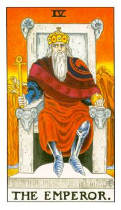

# IV.国王

牡羊座，火星代表杀戮与暴虐，在但丁神曲第四章有提到一些国王被锁链拘束着，口里喊着属于自己的霸业，埃及冥王的奥赛西斯，这个区块是寸草不生，他的表情充满惶恐，对自己比较相信不相信别人，穿着铁靴代表他随时要征战，他手上握的那个代表埃及的安卡(ankh)，是权力的象征，上面代表灵魂，十字代表结界，那颗球也代表权力的象征，他的座位上有四个羊头，除了透露出他是牡羊座的代表，他的焦躁都是为了别人的篡位，红色代表热情也代表行动力，渐层的红色代表无数人的血，不可侵犯的主导者，必须尊敬他。他坐姿也太表他随时准备侵略，在皇冠的上头有一只老鹰代表灵魂意指修自己的内在，皇冠也代表着12宫，蓝色的内袍代表他还是有理智的处理每个事情，在西方代表人物是亚历山大帝，中国的成吉思汗，后面坐着的石椅是立方石做成的是智慧之椅，立方石也称之为贤者之石。后面那条河就是冥河最后会流向女祭司后面的那个静湖里面。

牡羊座的代表，血染成的战袍，铁靴子代表随时要征战，令牌代表着安卡，上面代表着灵性，十字架是物质的代表。衣服里面的蓝色袍子代表着他的冷静。头上代表着12个黄道十二宫，埃及神话中奥赛西斯(Osiris)的代表。斜眼看人对应着中国古代的秦始皇或者是朱元璋，具备着霸权的状态，顺我者生，逆我者亡。代表行星火星，罗马神话代表玛尔斯(Mars)，代表着征伐。不怕斗不怕争，不喜欢被别人侵略，不要去处碰他的领域或界线。希腊神话则是阿利斯(Ares)他也可能代表着心血管或者是脑血管。

逆位: 暴政必亡的状态，他所建构所拥有东西都会结束。暴怒易怒，容易在事情的处理上失控。处事缺乏冷静，容易暴冲。

神话轶闻: 在埃及的神话故事中，奥塞西斯(Osiris)被赛特(Seth)分尸，伊西斯(Isis)则则是将这14个尸块全部找回来，在最后一个尸块，索贝克(Sobek)鳄鱼神有没有看到他的尸块，据说最后一个尸块是生殖器，在从鳄鱼那取得尸块后。将尸块全部缝合，他就复活成为冥王奥赛西斯(国王牌)。

鳄鱼的眼泪 (Crocodile Tears): 古埃及文献有记载：「如果鳄鱼在水边发现了人，就用尽一切方法杀死他，然后流着眼泪把他吃掉」。所以「鳄鱼的眼泪」是西方人用来指伪善者的眼泪。
