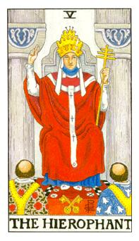

# V.教皇

灰色的柱子代表调和，头上的冠代表三重冠，圣父、圣子、圣灵此能量大于皇帝，那时候宫廷并没有绝对的力量，发动战争的都是教廷，在但丁神曲提到很多教宗死后都到地狱，因为他们都发动战争，在但丁神曲的两把钥匙，金色代表肉体，银色代表汞，教皇前面两把金色的钥匙代表都练成绝对的服从。后面两根柱子上面有两个奇怪的图案，那便是女身身体的子宫，可能代表抹大拉玛丽亚，因为他雌雄未定，皇冠得上方有个W暗喻着伟特即是教宗要引领大家。身体的装饰，蓝色的领巾代表冷静跟智慧，围住他的声带，代表他所说的话都经过谨慎的思考，所代表的星座便是金牛座，身上的缎带有三个十字和一个菱形，代表他要穿越空间，地毯上有黑白方格代表他要掌握谋略，人生如西洋棋的用意，下面有两个地中海的僧侣，因为这代表可以比较容易接触神明，就是天灵盖俗称百会穴。身上所穿着的分别是百合和玫瑰，有个Y字型的缎带俗称牛轭代表绝对的服从。

PS:依照卡巴拉三角形画下来就是驱邪咒，用见指的方式来画，其中还需要口诀，不要随意使用会引来不好的东西。中国道教上面有三把火，上面代表三个道教的始祖，最高的神不是玉皇大帝，而是灵保天尊、道德天尊(太上老君)、元始天尊。

已经入世，没有绝对的黑白，一切都是混着。秉持神的概念去辅导你们，让底下的人们得到救赎。他的脸可男可女，十分的秀气，雌雄未定，并不代表任何人物，可能是女神或者是教宗的模式。反讽罗马教宗不算什么，真正神圣的是女神。黄冠代表的是身、心、灵。三重冠的头上插着三根避雷针，我即是教皇，教皇即是我，伟特在发明这副牌的时候就想成为这世界的主。背后的象征意义金牛座，牡羊座代表着头，金牛座代表着喉咙，教皇的脖子蓝色的代表着冷静值和神圣的气结，非常的准确无比，说服力与影响力。身上白色缎带的部分就是埃及法老王的令牌安卡，没有圆圈所以是人间，圆圈代表着神殿或者是女神。白色也代表着纯洁，我接受上面的能量，我在物质界传递我的工作。但丁神曲中提到有个天使守住位阶，钥匙有两把，分别是浅意识和表意识，能够启动灵性的概念。女巫或是所谓的降灵者，这就是一种浅意识和表意识的整合概念。白玫瑰和红玫瑰是黄金黎明的代表，秃头代表接受神奇的力量。内里的白色代表纯洁外表的白色代表着救赎。贵人或者是媒介者，帮助人的角色。两性里面出现这张牌叫作协调者。底下两个人换掉可以代表着证婚。正财宫，非常具备荣耀的金钱，所赚的钱都是问心无愧。

逆位: 一个好的介绍人，可是具备着私心，从自己有利的角度去评断事情，代表着小人或者是谎言。语言具有欺瞒欺骗，容易造谣。
