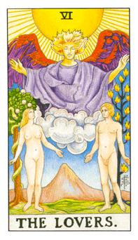

# VI.恋人

拉斐尔主掌风元素的天使，头上彩色的光辉代表强大的反物质力量，从翅膀数去算位阶，拉斐尔是伊甸园的守护者，伊甸园称他们为基路博，他是炽天使，也就是六翼天使，伟特在画这张牌又希望她画成三角形的调和，男生就是为性而爱，女生是为爱而性，她把她的眼神瞄向天使询问男生是否为真命天子，女生代表夏娃，男生代表亚当，后面有5颗果实有一棵被吃掉，那颗果实是五觉里面的感觉，开始有了喜怒哀乐，当有了这颗后面才吃了其他颗而产生的五感，后面那颗代表圣山，代表绝对的阳性，亚当后面代表生命之火树，代表欲望和生命力，那条蛇代表古蛇萨迈尔，伊甸园的部分也提到诺亚方舟。所代表的是风元素代表双子座，他是一种沟通的状态，讯息的传递，和谐与良好的友谊。风会把种子传播到各地所以代表讯息传递。

圣洁，图像背景是伊甸园，男生代表着火星，女生代表着金星，1910年订出一个理论，男生为性而爱，女生为爱而性。风元素里面的代表，天使代表着大天使拉斐尔，教导人们农耕和畜牧，也代表着生存的技巧。在还没有吃下禁果前他们是纯洁的。古蛇萨麦尔(Sammael)，蛇不是上帝所创造的，最古老的欲望，牠在夏娃的耳朵旁轻轻地说，果实非常好吃，果实分别代表五感。她吃下了一颗，而亚当后面的是生命之火，拉斐尔(Raphael)藉由这些火来使人们有能力工作。头上的头发的概念代表着智慧之光，头上被太阳所顶着，他所有的一切都来自神的旨意。拉斐尔是大天使从翅膀可以看出来。身上的袍子代表着智慧。因为亚当和夏娃偷吃果实被赶出来，后面的圣山代表着欲望，突起的状态。这张牌也代表着友谊或者男女之爱也可能是家庭的爱。要看当时的牌阵或问题而定。主轴是双子座，他的别称代表着多变，所以爱情才会如此多变。

逆位: 良善的友谊和友情，在爱情也可能代表着分手，感官上的看法不一样了，两个离开伊甸园，两个人不同心，其中一个人离开了当时的承诺，立足点不同。在人合上面，可能要做好互相分享的状态。圣山变成物质的山，这个人的爱不再是单纯的爱。

七大天使: 米迦勒(Michael)、加百列(Gabriel)、拉斐尔(Raphael)、乌列尔(Uriel)、拉贵尔(Raguel)、沙利叶(Sariel)、雷米尔(Remiel)
