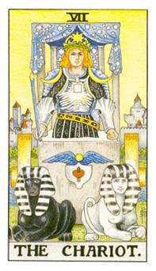

# VII.战车

牌的下方是立方石也是贤者之石，战车的上方有很多星星的布幕，代表的是穷仓，有四根柱子，这根柱子的组合式1,4,2=7，4代表稳定代表正方石的稳固，白的代表表意识，黑的代表浅意识，蓝色的法杖是乙太子，没有缰绳是因为，他透过他的意志去控制这两个生物，蓝色的翅膀代表鸟类，鸟类在神秘学当中代表升华后的精华。白色的与红色的部分代表阴阳结合，升华出来而成的翅膀，中间黄色则是代表升华点，把容器倒过来是一个帽子，这帽子就是阿蒙，法老王上面的那个帽子，代表具有强大力量才可以用，代表在法王容器煮沸，阴与阳融合，成为一片混沌，之后升华出来的就是天使之泪，所谓的结晶体。
这张人物的头上那棵大星星，顶着8芒星，顶端的力量，这人物的左肩和右肩有两道弧形的力量，上头的两个脸孔分别代表猜忌和怀疑或者是愤怒和哀伤，在往下会看到中间胸前有个正方形，代表土元素，稳定质摆在心中代表坚定的意志，他的盔甲充满甲壳的感觉所以对照巨蟹座，这张主轴在于他相信自己的力量能够保护他的家园，这两批生物代表埃及智慧之神斯芬克斯。身上的符号也有人说是欧甘文。7号在灵数学中代表坦承和信赖，在神秘学中代表天使的最大位阶，这数字是非常神圣的天使。

没有下半身，在石头里面，立方石里面俱备法能，使得他觉悟度很大，两个生物分别代表浅意识和表意识。没有透过缰绳去控制，而是他靠着意志力来操控。他头顶的星空帷幕代表着宇宙，宇宙所下来的力量被他的四根柱子撑住了，代表宇宙以他为中心，他的左肩和右肩代表着上、下玄月，控制着他情绪变化，有个哭脸和笑脸代表着怀疑和猜忌。头顶的星星有八芒星，代表重生的力量，也代表着天狼星的位置。他身上有一个正方形的图形，代表着土元素也就稳定的状态，他用这个结晶体，心窝代表心神，膻中穴(在体前正中线，两乳头联机之中点)往上一点是本性元神的所在地，不管轮回多少次，人身上有70兆细胞，情绪的总结就是从这边开始，最痛和最酸的地方，本尊的元神所在地。在这里的正方形是土元素用来统合自己，内外合一，很强大的力量。战车是海王子，从他的穿著可以看出来，他代表的星座即是巨蟹座。上面有很多的北欧符文。白色的帽子反转过来就是埃及法老阿蒙所戴的帽子，所有的能量和智慧都聚集在这里，也是他承载所有力量的象征。陀螺是印度教湿婆神的代表，所主张的就是破坏与重生，直的就是破坏横的就是重生，这也代表着交合的动作。能量在这里产生会在这里产生灵性，这里在酝酿把气流往上升，给这个人使用，这个人超越灵而成为精神的概念。斯芬克斯(Sphinx)在埃及是最聪明的神兽。巨蟹座的最大功能就是相信自己保护的东西。坚决的战斗力与强大的自信，可以随时克服恐惧的状态，非常有自信的自我。

逆位: 平衡感比较差，欲速则不达，对自己怀疑与不信任，没办法去控制内在情绪，因为想法太过于悲观。不俱备控制力的一个人，六神无主，没办法得到一个明确的目标。
