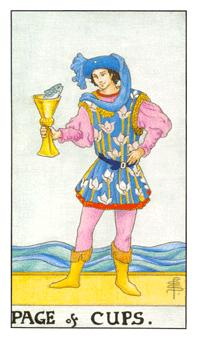
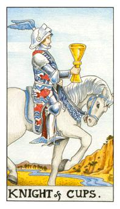
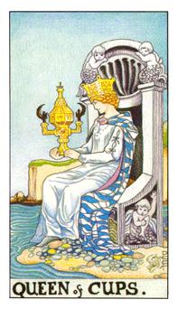
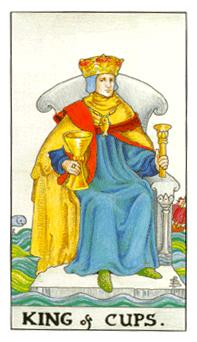

# 宫廷牌

- 行业：设计师、画家、艺术类别的创作者
- 体态描述：腰都比较细，身材很好

| 宫廷角色 | 年龄 | 角色     | 星座 | 属性 |
| -------- | ----- | -------- | ------ | -------- |
| 圣杯侍者 | 25~30 | 青年     |        | 水中之风 |
| 圣杯骑士 | 30~35 | 年轻男子 | 双鱼座（变动水象） | 水中之火 |
| 圣杯皇后 | 35~40 | 母亲     | 巨蟹座（本位水象） | 水中之水 |
| 圣杯国王 | 40~45 | 父亲     | 天蝎座（固定水象） | 水中之土 |

## 圣杯侍者

来者不拒，宁可错杀不可放过，侍者对于某种事物产生喜欢或好奇，她对于很多事物都很有兴趣。一副得意的样子，乐此不疲。水中之风

站在港口边，背后的海水是很深的。鱼代表的新鲜有趣，粉红色代表浪漫，他把所有注意力放在鱼身上，这样也代表他没有注意到周围的危险。感情是不稳定的，也代表有趣或者是新的模式。杯子里装的就是你喜欢的事物，但是也代表你对这个人了解不多。

逆位：他对这东西失去兴趣，跌到水里或海里，当时的立足点不够坚固，所有的东西都遗失了。他不知道他要什么所以他原本拥有的东西都遗失了。代表喜欢的事务结束。

## 圣杯骑士

双鱼座的代表，头上的羽毛代表灵魂性的升华，双鱼的灵性，奉献无私的，代表着浪漫，这个男生应该是这女生喜欢的类型。良好的友谊交流。水中之火

河流是绵延不断的，代表他攻击或追击都是有耐心的，白马代表纯洁的心灵，白色的盔甲是坚强的伪装，头冠上的羽毛翅膀，代表着灵性的代表。这个人的爱是真爱，绵延不断的爱，在荒谷中仍然流动，坚持到最后。这么专注于爱情的人很容易失去面包，这个人可能不太有钱。

逆位：烂桃花，只是表征看起来很棒，内在却很没有诚意，很多感情说不出口。用情绪来看就是这个人不太会表达，他的感情是隐藏的。

## 圣杯皇后

圣阙就像是圣母玛利亚的子宫，等待爱情的女生，这女生温柔体贴又善解人意。理解外在变化，悲天悯人，圣杯皇后主轴的皇后的爱情，包容与等待还有耐性，也可以代表即将受孕，她自身已经调解完整了。圣杯皇后的女性，身材很好但是脸都不漂亮，对应着巨蝎座，年龄约30~35之间。她座位上面有个庞大的贝壳，里面有着珍珠，代表孕育的模式，她的座位旁边有小孩子在玩，在表她期待着新圣命的开始。水中之水

国王的海是波涛汹涌，皇后的海却是稳定，这代表有耐心的等待，圣爵代表的子宫，从里面诞生出圣子。这女生所代表的就是包容、宽心、等待，是所有男生心理所爱的，椅子旁边的小孩子周围的五彩石代表的是能量，这女孩体谅人心、不计较、宽宏。她只会在湖边静静等待爱人归来。她表情是微笑的，她是满足的。

逆位：烦躁、悲观、泼辣、心情非常不稳定，因为圣爵都掉下来了，孕育的东西
不如预期的产生，必须告知问卜者该注意的身体或心灵上的调整度。国王和皇后可能都是长辈，顺着对方的意思，不要逆道而行。

## 圣杯国王

座位矗立在大海之中，感情丰富向海里的水产一样多，也能包容一切，水母帽，座位在海里面代表他是感情里面的主轴者，他的爱情是成熟专情的在大海中摇动他仍然屹立不变，他的感情很霸道也很直接，很澎湃很汹涌也很多，对应的星座是天蝎座。他很喜欢操控对方，希望对方能什么事情都跟他讲，让她聊若指掌，这样他才会放心。水中之土就是他的代称，情感的社会工作者、艺术家、音乐家、画家，和美学很有关系。脖子上挂着一条晒干的竹䇲鱼，代表着牺牲。水母杖，水族的代表。蓝袍代表深不可测，黄袍代表光明，他的爱情是光明的，也是长久的付出。鱼代表两个人的感情和感受，代表他很会照顾女性。杯子代表着血液和内分泌。水也代表着线条，代表他身材会很好。

有绝对的掌控力和满足感，这代表的是感情的忠贞不移，但他是绝对的忠贞或是游离。天蝎女眼神带电，很有吸引力。国王身处在波涛之中，不管是在人世间多么波涛，他仍然屹立不摇。他在贤者之石(立方石)。他带的是水母冠，水中之王，权杖代表的是对爱情的掌控力，黄袍代表光亮和光明，红袍代表的热情，他的爱就像海一样宽广。在工作的场合上代表的是文教类、艺术类比较适合。他的情绪安定，专注在他所在意的人身上，这张牌也可以代表着家人对你的支持。由上往下的支持或支援，想要成为这样的男人去照顾女人。

逆位：王有灾难，感情不再坚定，情绪很不稳定，失去的照顾的本质，没有责任感。表面上看起来很成熟但实际上却很不负责。他不敢俱备承诺，因为他对自己没有把握。这个人状态不好，容易受到外界的干扰。

