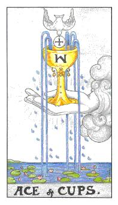
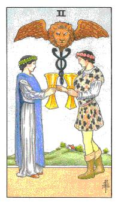
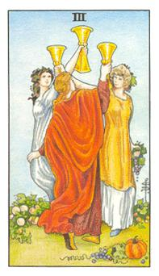
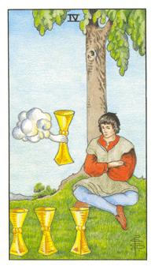
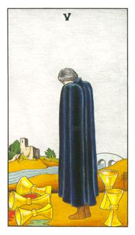
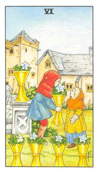
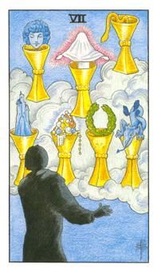
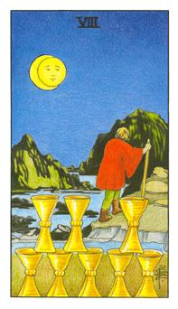
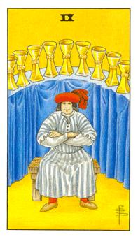
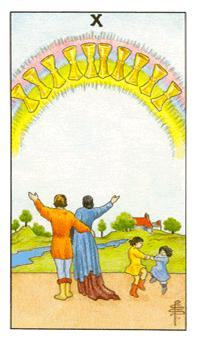

# 数字牌
水：流动、纯净、沟通、柔和、依型态、清澈、激荡、清心

## 圣杯Ace

白鸽就是上帝，十字型的就是圣饼，隐喻为上帝的精子，圣阙即是子宫，所有的生命从里面跑出来，五感的诞生，人生开始有了生命。倒M代表的抹大拉马里亚的子宫。将贤者之石丢入永恒的盆子里面，产生的生命滋润万物，胜父是手，圣子是白鸽，圣灵是圣饼，圣杯是圣母。四合。

代表所有的事物，生命之湖的一只手，无中生有的一段感情，或者是和情有关的机会出现，上面的白鸽代表上帝的出现，钱币代表精子和圣杯去做结合，圣杯代表子宫，这个杯子是无中生有，突然出现的一个邀约。

逆位: 感情不再出现，感情不会在发展。内在情绪被盖住，你无法在对这个人付出情感，一个接触点的结束。或者这个感情或邀约遗失了。

## 圣杯2

是两个相互元素的第一个磁场，暧昧的状态，男生是汞，女生是硫。两个元素产生感受和暧昧，产生相互关系的情愫。双蛇杖代表二元合一的完成。长出的翅膀代表已经初步完成了。

代表的是分和合，产生暧昧的关系，小恋人的概念，情愫上的产生，有情已达，对彼此都有好感，但还不到恋情。这张牌也是情感上的连结。

逆位: 分手，这个爱恋决断了，从本来的有到没有。失去好感，感情不再存在。

## 圣杯3

代表共同庆祝，三个人以上的同型欢乐，情感上多一个，所谓的多角关系，不论在人际和友情，代表他是一个亲和力很高的人，是一个好的陪伴者与公同欢乐参与者。

三个杯子在头顶上称之为小三

逆位: 有一些事情是无法说出口的，有口难言，有话说不出来。这也代表着地下恋情。不擅于沟通的人，隐藏自己的情绪，给人的感觉较闷。代表当事人的情绪抒发上不够完整。

## 圣杯4

是稳定的，为了避免混乱而去拒绝的稳定，恐怖平衡的稳定，为了刻意而刻意的沉稳。

如果给我三个杯子，我可以控制，可是多一个杯子就会感到疑惑。带给人心动的感觉，云中出现的东西也代表着天上掉下来的礼物，相当吸引当事人。稳定的情绪，不该受到干扰或诱惑。必须守住他的所有，类似圣杯国王，要懂得守。

逆位: 接受以后的成果，受到诱惑而无法操控，导致于旧的无法完整结束，新的却也没有完整的开始，一种混乱的结果。

## 圣杯5

三个元素倒了剩下两个杯子，他后悔。他的战友与所有支持者都离他而去，他是孤单的，他也代表着落寞。花园里面正举行着婚礼，而他却不是男主角，而喝着闷酒。

花园里面的主人，醉的醉，倒的倒，但是这些人里面却没有人能理解他，这个主人十分的孤单，黑色的批风代表着一种阻隔，不想让人进入他的内心。缺乏一个好的伙伴或者是支持者。这个人在爱情中都是牺牲的角色，但是却没有表达过自我的感受，内在十分空虚，为了对方而活。

逆位: 过去的事情无法挽回，这个人的内心十分的遗憾与后悔。

## 圣杯6

别名回忆，又称为沟通，单纯的交流，白百合代表的单纯，里面是纯硫或纯汞，初步完成的丹药。

角是两个小孩子，白百合代表纯洁，整体牌面代表着友谊，画面上呈现童趣。也代表着当事人可能回忆着过往的美好。也可能是被支援的概念，支援者可能是朋友，所受到的东西都是善意的。当事人可能放不下过去的回忆，当下受到的阻碍时分的大，困扰着当事人。

逆位: 认清现实，情绪上的表达较为直接。容易抱怨，两者个交流变的不平衡，善意转为恶意。

## 圣杯7

头巾天使代表性灵，魔鬼代表欲望，房子代表资产，珠宝代表财富，蛇代表疗育，桂冠代表荣耀，人头代表智慧。简单表示就是想太多，想像与事实有很大的落差。

白日梦，幻灭是成长的开始，这个黑衣人代表着浅意识的孤单，恶魔代表欲望，蛇代表重生，光芒代表上天的眷顾，人脸代表着智慧，珠宝代表财富，桂冠代表荣要，房子代表资产。这个人把自己太不自量力。

逆位:终于认清事实的模式，大梦初醒的状态。

## 圣杯8

月黑风高，满月炼金能量最强。这个人是炼金术的高手，他深知八个杯子还没办法完成，他去寻找第九个。遗留在你最在意的区块，往上坡走。这张牌也有驱赶的感觉。

这个人是不得不走，他心情十分的难过，底下的杯子是他原有的人事物，在物质界的模式已经足够了，但是他必须走向精神层面，通往王道之路，在神秘学中8是最大的能量，他拥有强大的祝福与痛心的概念。祝福对方到更好的地方。

逆位:离不开，放不下一切的事物，没办法朝着更高处发展。

## 圣杯9

代表着得意，好运势成的代表，他最能够掌握这9个杯子的变化，他能够应对现在所有的状态。

这个人有办法去掌握后面的东西，这个人是十分的开心，所有的发展都如预期般开始，并没有意外的发生。

逆位: 是一种恐惧感，现阶段的所有一切他都无法掌握，他无法去进展。晴天霹雳，每个杯子都是环节的一部分，就是崩解的状态。

## 圣杯10

彩虹光的三要素，红黄蓝(三原色)，幸福的部分，彩虹桥又是北欧神话的传输之桥。这张牌也代表着举家和乐的状态。

孔雀的概念完整的完成，神秘魔法石的最后一关，杯子就是结晶体。情感面是一个完整的状态，幸福与美满。在婚姻中虽然这个人没有太大的财富，但是他们安平乐到，不主轴物质的世界完善，但是他们心意相通。公司的向心力很强，主在于家族。

逆位: 湖中的彩虹，代表着幸福的假象，当事人曾经想过或者是梦过这完美的画面，但是他并没有完成。或者是刚结婚就离婚，而当事人充满着懊悔。
