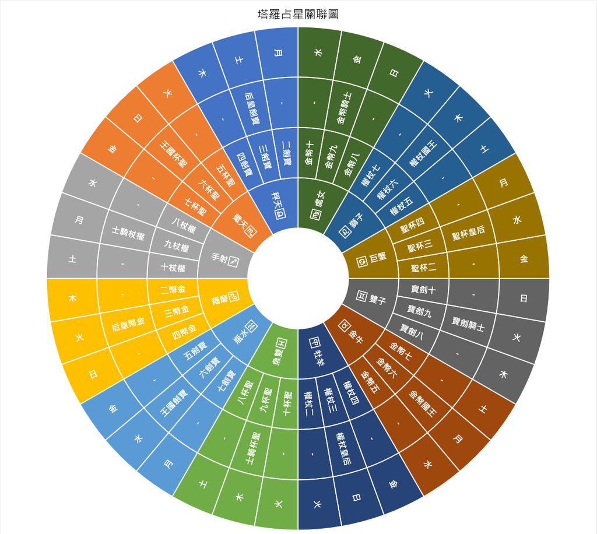

# 塔罗与占星的对应方式

下面內容引自 [cyliu12 文章](https://cyliu12.pixnet.net/blog/post/216571903)

大牌22张，刚好是12星座加10颗行星的数，一张牌对应一个星座(或行星)，刚刚好。行星包含太阳、月亮、火星、水星、木星、金星、土星，天王星、海王星、冥王星。为什么太阳跟月亮都算行星?这是从占星学角度看的，只要在黄道上会移动的，都叫行星啰，这是地球中心的概念，也是从地球观察天体会看到的现象。
至于56张小牌，乍看好像有点规律可循，又好像是乱的。没错，是有规律的。如上圖

首先将十二星座在圆上依序排开，牡羊、金牛、双子、巨蟹、狮子、处女、天秤、天蝎、射手、磨羯、水瓶、双鱼。每个星座各占30度，共360度。每个星座划成3等份，每份占10度，总共就是36份。由牡羊座开始，依序写下2~10等九个数字，重复四次正好36个数字。再由牡羊座开始，依序写下权杖、金币、宝剑、圣杯。如此一来，小牌中的数字牌，除了王牌(1)之外，每张牌就都有定位了。按图写成表的话就如下表。

另外还有宫庭牌，侍者没有对应星座，骑士对应变动星座、皇后对应基本星座、国王对应固定星座。所以权杖骑士对应射手、权杖皇后对应牡羊、权杖国王对应狮子。圣杯、宝剑、金币请详下表。

要说行星跟小牌的对应关系的话，一样回到上述的圆，从牡羊座的第一个10度开始，依序写下火星、太阳、金星、水星、月亮、土星、木星，重复五次之后，最后再写一次火星，就可以得到这七颗行星跟36张数字牌的关系。

至于王牌(1)跟侍者为什么没有对应的星座或行星，我认为，1是开始、1生万物，1是根，所以不特别去对应星座或行星。侍者在宫廷牌中也代表新生跟开始。

| 中文           | 英文                | 所属元素 | 关联星座 | 关联行星 |
| -------------- | ------------------- | -------- | -------- | -------- |
| 愚人（0）      | THE FOOL            | 风       |          | 天王星   |
| 魔术师（1）    | THE  MAGICIAN       | 风       |          | 水星     |
| 女祭司（2）    | THE HIGH  PRIESTESS | 水       |          | 月亮     |
| 皇后（3）      | THE  EMPRESS        | 土       |          | 金星     |
| 皇帝（4）      | THE  EMPEROR        | 火       | 牡羊     |          |
| 教皇（5）      | THE  HIEROPHANT     | 土       | 金牛     |          |
| 恋人（6）      | THE LOVERS          | 风       | 双子     |          |
| 战车（7）      | THE  CHARIOT        | 水       | 巨蟹     |          |
| 力量（8）      | STRENGTH            | 火       | 狮子     |          |
| 隐士（9）      | THE HERMIT          | 土       | 处女     |          |
| 命运之轮（10） | WHEEL OF  FORTUNE   | 火       |          | 木星     |
| 正义（11）     | JUSTICE             | 风       | 天秤     |          |
| 吊人（12）     | THE HANGED  MAN     | 水       |          | 海王星   |
| 死神（13）     | DEATH               | 水       | 天蝎     |          |
| 节制（14）     | TEMPERANCE          | 火       | 射手     |          |
| 恶魔（15）     | THE DEVIL           | 土       | 磨羯     |          |
| 高塔（16）     | THE TOWER           | 火       |          | 火星     |
| 星星（17）     | THE STAR            | 风       | 水瓶     |          |
| 月亮（18）     | THE MOON            | 水       | 双鱼     |          |
| 太阳（19）     | THE SUN             | 火       |          | 太阳     |
| 审判（20）     | JUDGEMENT           | 火       |          | 冥王星   |
| 世界（21）     | THE WORLD           | 土       |          | 土星     |

| 中文     | 英文            | 所属元素 | 关联星座 | 关联行星 |
| -------- | --------------- | -------- | -------- | -------- |
| 权杖一   | ACE OF WANDS    | 火       |          |          |
| 权杖二   | TWO OF WANDS    | 火       | 牡羊     | 火星     |
| 权杖三   | THREE OF WANDS  | 火       | 牡羊     | 太阳     |
| 权杖四   | FOUR OF WANDS   | 火       | 牡羊     | 金星     |
| 权杖五   | FIVE OF WANDS   | 火       | 狮子     | 土星     |
| 权杖六   | SIX OF WANDS    | 火       | 狮子     | 木星     |
| 权杖七   | SEVEN OF WANDS  | 火       | 狮子     | 火星     |
| 权杖八   | EIGHT OF WANDS  | 火       | 射手     | 水星     |
| 权杖九   | NINE OF WANDS   | 火       | 射手     | 月亮     |
| 权杖十   | TEN OF WANDS    | 火       | 射手     | 土星     |
| 权杖侍者 | PAGE OF WANDS   | 火/风    |          |          |
| 权杖骑士 | KNIGHT OF WANDS | 火/火    | 射手     |          |
| 权杖皇后 | QUEEN OF WANDS  | 火/水    | 牡羊     |          |
| 权杖团王 | KING OF WANDS   | 火/土    | 狮子     |          |

| 中文     | 英文           | 所属元素 | 关联星座 | 关联行星 |
| -------- | -------------- | -------- | -------- | -------- |
| 圣杯一   | ACE OF CUPS    | 水       |          |          |
| 圣杯二   | TWO OF CUPS    | 水       | 巨蟹     | 金星     |
| 圣杯三   | THREE OF CUPS  | 水       | 巨蟹     | 水星     |
| 圣杯四   | FOUR OF CUPS   | 水       | 巨蟹     | 月亮     |
| 圣杯五   | FIVE OF CUPS   | 水       | 天蝎     | 火星     |
| 圣杯六   | SIX OF CUPS    | 水       | 天蝎     | 太阳     |
| 圣杯七   | SEVEN OF CUPS  | 水       | 天蝎     | 金星     |
| 圣杯八   | EIGHT OF CUPS  | 水       | 双鱼     | 土星     |
| 圣杯九   | NINE OF CUPS   | 水       | 双鱼     | 木星     |
| 圣杯十   | TEN OF CUPS    | 水       | 双鱼     | 火星     |
| 圣杯侍者 | PAGE OF CUPS   | 水/风    |          |          |
| 圣杯骑士 | KNIGHT OF CUPS | 水/火    | 射手     |          |
| 圣杯皇后 | QUEEN OF CUPS  | 水/水    | 牡羊     |          |
| 圣杯团王 | KING OF CUPS   | 水/土    | 狮子     |          |

| 中文     | 英文             | 所属元素 | 关联星座 | 关联行星 |
| -------- | ---------------- | -------- | -------- | -------- |
| 宝剑一   | ACE OF SWORDS    | 风       |          |          |
| 宝剑二   | TWO OF SWORDS    | 风       | 天秤     | 月亮     |
| 宝剑三   | THREE OF SWORDS  | 风       | 天秤     | 土星     |
| 宝剑四   | FOUR OF SWORDS   | 风       | 天秤     | 木星     |
| 宝剑五   | FIVE OF SWORDS   | 风       | 水瓶     | 金星     |
| 宝剑六   | SIX OF SWORDS    | 风       | 水瓶     | 水星     |
| 宝剑七   | SEVEN OF SWORDS  | 风       | 水瓶     | 月亮     |
| 宝剑八   | EIGHT OF SWORDS  | 风       | 双子     | 木星     |
| 宝剑九   | NINE OF SWORDS   | 风       | 双子     | 火星     |
| 宝剑十   | TEN OF SWORDS    | 风       | 双子     | 太阳     |
| 宝剑侍者 | PAGE OF SWORDS   | 风/风    |          |          |
| 宝剑骑士 | KNIGHT OF SWORDS | 风/火    | 射手     |          |
| 宝剑皇后 | QUEEN OF SWORDS  | 风/水    | 牡羊     |          |
| 宝剑团王 | KING OF SWORDS   | 风/土    | 狮子     |          |

| 中文     | 英文                | 所属元素 | 关联星座 | 关联行星 |
| -------- | ------------------- | -------- | -------- | -------- |
| 金币一   | ACE OF PENTACLES    | 土       |          |          |
| 金币二   | TWO OF PENTACLES    | 土       | 魔羯     | 木星     |
| 金币三   | THREE OF PENTACLES  | 土       | 魔羯     | 火星     |
| 金币四   | FOUR OF PENTACLES   | 土       | 魔羯     | 太阳     |
| 金币五   | FIVE OF PENTACLES   | 土       | 金牛     | 水星     |
| 金币六   | SIX OF PENTACLES    | 土       | 金牛     | 月亮     |
| 金币七   | SEVEN OF PENTACLES  | 土       | 金牛     | 土星     |
| 金币八   | EIGHT OF PENTACLES  | 土       | 处女     | 太阳     |
| 金币九   | NINE OF PENTACLES   | 土       | 处女     | 金星     |
| 金币十   | TEN OF PENTACLES    | 土       | 处女     | 水星     |
| 金币侍者 | PAGE OF PENTACLES   | 土/风    |          |          |
| 金币骑士 | KNIGHT OF PENTACLES | 土/火    | 处女     |          |
| 金币皇后 | QUEEN OF PENTACLES  | 土/水    | 魔羯     |          |
| 金币团王 | KING OF PENTACLES   | 土/土    | 金牛     |          |
