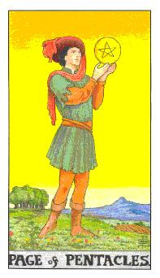
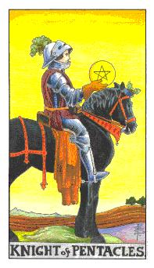
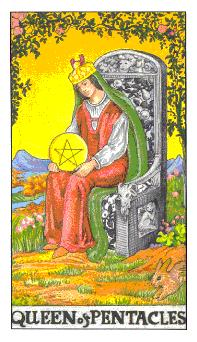
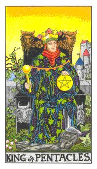

# 宫廷牌

- 行业：传统行业、服务、金融业
- 体态描述：身高大概170cm之间，女性的屁股和骨架比较大，看起来容易生。

| 宫廷角色 | 年龄 | 角色     | 星座 | 属性 |
| -------- | ----- | -------- | ------ | -------- |
| 钱币侍者 | 25~30 | 青年     |        | 土中之风 |
| 钱币骑士 | 30~35 | 年轻男子 | 处女座（变动土象） | 土中之火 |
| 钱币皇后 | 35~40 | 母亲     | 魔羯座（本位土象） | 土中之水 |
| 钱币国王 | 40~45 | 父亲     | 金牛座（固定土象） | 土中之土 |

## 钱币侍者

这颗球像是金钱也是价值观，也可以说是人生的新方向或者是价值观的存在。一个转捩点的出现。

逆位: 找不到新的契机点与想法，走不开。想法与看法随时再变缺乏稳定，虎头蛇尾的可能性很高。

## 钱币骑士

火代表着干劲，黑色代表着孕育的状态，帽子上面那个是菜头，代表着丰富的农作物。胸膛与骨架比较厚实，给人很棒的安全感。身材比较矮，代表星座处女座。稳定与扎实代表，黑色的马代表着才华，在进行事情的时候是很扎实与稳定，不会随便了事。慢的很精致。做人很有诚意，有自己的主轴和节奏可以完成很多事情。

逆位: 变动性变得很高，土就会变成砂，运作受到影响，萝卜长不出来，成果腐烂。给人杯弓蛇影的感觉，缺乏实际感。他的说法和想法很流畅但是在实做的时候容易出问题。

## 钱币皇后

扎实里面带有人性的概念，生活品质也很好，羊头所代表的是魔羯座也是这张牌的代表，石榴所代表的是补血，手上握着的可能是下一代也可能是代表资产，衣服遮起来就是怀孕的状态，画面中出现一个兔子，动如脱兔，静如处子。皇后再城堡里面等待国王回归，她是个很有目标性的女生，很懂得运用机会。善于等待和执行，她坐在椅子上比较被动，不到最后不会出手。孕育的象征。有资产的女性。背后的花园是她所属的领域或者是资产，要她照顾你很容易但是要追求她比较困难，因为她生活很有步调和品质，因此她不容易晃动。她对孩子的照顾是无微不至的。很独立自主的女性。内在十分的聪慧和聪明。

逆位: 奢华的感觉，执行的部分比较躁动，缺乏稳定，她过度奢华享受，选物质对她有力的，有点像是物欲型的女性，这张牌给人感觉不忠贞，定性很差，有点像是拜金女。

---
**牌义比较**
权杖皇后(逆)：比较主观性，才容易放荡
宝剑皇后(逆)：容易孤寡，容易受到资讯类的动摇

---

## 钱币国王

葡萄代表风收的果实，衣食无虑，脚上踩着狒狒，这只是埃及的智慧之神透特，也可以化身为欧洲的猫头鹰，也代表着智慧，代表他赚钱的模式都是运用手法，这张牌也代表着金牛座，黑色代表肥沃的泥土，代表他拥有强大的资源和能量，背后的城堡是他的家园，这张牌的主轴在于管理，生活品质很好，经济能力也很好，城堡可能也代表着他的不动产，拥有很多房子。这个人可能有点自恃过高，经过很多的征战和计谋才获得现在的财富因此看不起人。在这个人身上不可以违反他所定下来的规则。他培养性很高，他会希望你配合度高而不是背道而驰。土拥有排他性也拥有关联性。土性的人喜欢被问，这个人一定会教导你。

逆位:代表资产出现问题，浮夸，话说太满，说到极致但缺乏实际作为。表面上看起来很棒但是缺乏内再。财物出现危机，目前理财方式过于松散，太过于放松自己的物欲和食欲。座位不安稳，不务实喜欢骗人，财务出现危机。
