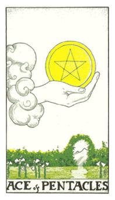
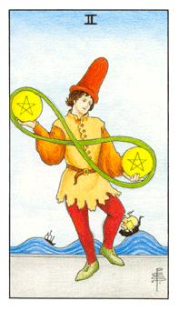
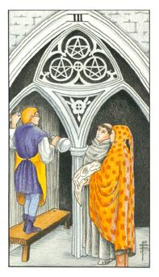
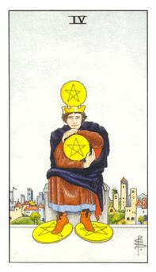
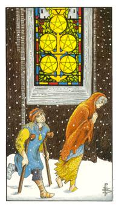
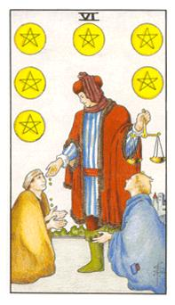
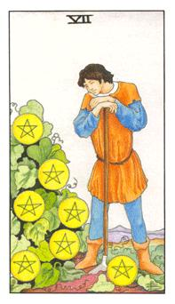
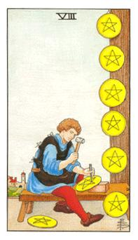
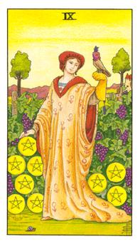
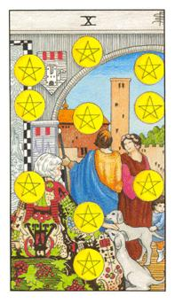

# 数字牌
土：孕育的概念，有培养的概念，大地扎实的概念也有厚重的感觉

钱币是一个运化的方式，权杖是一个生命点的出现

## 钱币Ace

蔷薇花园是圣殿骑士的所在，左边的手都是阴，右边是阴。与命运之轮相结合的意义，是一个实质的机会与展机或变化。

这是一个价值观与想法，也可能是一种新的契机或者是突然获得一笔金钱。横财的概念。突如其来的生意。恋爱之间可能是有新生命出现是已经确定会有的结果，圣杯则是正在进行的状态，白话点就是正在调情当中。要进入黄金黎明，妳要缴很多的钱，所有的会员都需要缴交很大一笔钱。

逆位: 很多东西是不存在的，原本拥有的突然失去。突然而来的意外造成破财的概念。

## 钱币2

他不知道如何将这两个金币的能量作运用，影响整个世界潮流的经济面。

八字的符号代表运筹帷幄的状态，输送的模式，周转当中。小丑的衣服和帽子代表他在运转的过程中没有很用心，需要审慎的判断与抉择。如果他所引动的是背后的海水，需要更加谨慎去做投资。太过于轻忽这个机会，而失去操控的机会。两个选择可能都不是最好的选择，应该选择稳定就是都不做决定。要看当事人的状态是一时兴起还是原本该遇到的。

逆位: 造乱以后的结果，不需要去改变这些选择。现在的状态不好收拾，把事情理解清楚，需要把事情逐一整理和归位。

## 钱币3

沟通是主要轴，要决定谁是主谁是从。3也代表着开展型。

合作与协调，橘红色的是设计者，蓝色衣服的是工匠，白色的衣服与橘色的衣服再交流，三者需要不断的沟通与协调，不能一意孤行，必须让群体之间达到认同。找对的人做对的事，然而透过沟通与协调去完成一个不朽的作品。

逆位: 所有的东西都掉下来了，以现实面做考量，缺乏理念，或者是三者都不愿意退让，彼此都不肯退让。事情停顿毫无进展。

## 钱币4

守财奴、小气财神，房子代表实质的呈现，以保守贯穿牌义。

小气财神，锱铢必较的过于保守，坐在王位上面，通常是组长或者是管理者，他是实作者，他十分保守没办法去接受新的事务。表情十分的忧愁，他只是初步达成一个位阶，可是他谨守现在拥有的，因此无法在提升上去。

逆位: 基础重新开始，代表一切都失去了，但同时也代表获得更多。放掉了才能重新拥有。

## 钱币5

实质的状况，解决需要时间。是一种困境。

贫贱夫妻百事哀，女人的耐性总比男人强，一个困境的代表，在冰天雪地里面取得不到钱，十分的艰困。两个人走到一个僵局，彼此相爱却没办法给对方一个交代。看到问题所在却无法解决问题。男女代表阴阳性同时被困在虚境里面，钱代表着虚假的模式。

逆位: 两个人拆伙了，简而言之就是脱困，是经济与外在环境分开了他们。脱离这个画框各走各的。分开以后两个人比现在好。

## 钱币6

支援性，施舍也是一种生意的状态。他是具有衡量性的给予。

衡量者，衡量自己的能力去帮助别人。红色的硫与蓝色的汞，两边都需要添加物质使其长大。6代表着真善美的概念，人性最美的状态。能帮就帮就是他的特质，施与力量给对方。可能是给予或被给予。凡事要懂得量力而为。

逆位: 泥菩萨过江自身难保，只能先自救。先把自己的定位整理好再重新出发，不要去干涉其他的事情。

## 钱币7

代表着一个段落或句点。

7颗葡萄都成熟，代表着过熟，农夫的哀愁是我把这些采收完后我该怎么进行下一个步骤。所有事情进展到这里有初步成果，需要知道下一步该怎么做。这片果园需要再种植什么比较适合。1+6:6是完美的葡萄、1代表着侍者的那颗球，这颗球的方向到底该怎么走该怎么使用。

逆位: 所有的累积与资产都没了，突然不预期的坏事或者是失去。原本计划的东西突然归零或不存在。

## 钱币8

工匠牌，专业的技术可称为精铸者，技艺高强。第8个才是精神的所在。一个辛勤的工作者，按部就班的工作。不太会做白工。

精铸者，执行者是最高的模式，我所做的东西都可以挂在墙壁上做为一个荣耀，只要专心去完成对方都会看的到。尽量去完成，在健康中代表脊椎或骨盆酸痛需要多加休息。

逆位: 所做的事务是不会被看见的，现在所进展的方向是错误的。现在的施力点不对怎么做也没用，因此缺乏赞赏

## 钱币9

鸟是禁锢的自由，袍子代表在意趋势，钱币代表务实的价值观，蜗牛代表着慢火和悠然自得的人生，看到脸代表着可望性与正在性。

缓慢的移动，有果实有钱，现在只期待钱的符号，她希望有人陪伴，这个葡萄园是他的自己领域，同时这个人是有很棒的物质生活但是缺乏感情，她宁缺勿滥。她希望找到伴侣但是单身也可以。

逆位: 非常忙碌，所有东西都掉出来了。十分的烦乱，这个人生活没有常规，很纷乱、没有快乐的感觉，所以非常的疲倦。

## 钱币10

代表团队，完成卡巴拉的生命之树。意旨团结与获利很大。

卡巴拉的状态，组织家庭，团结的状态、完美的模式与组织方式。向心力很强，必须去陪何对方的家庭。这个团队是非常棒的，因为大家彼此契合。你对家庭的向心力十分的向往。

逆位: 搬家、被偷、失火。团队分解了、缺乏家庭的关爱。
