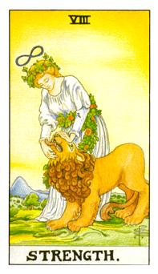

# VIII.力量

女神主义很强烈的牌，纯粹是炼金术的牌，白色代表巩、红棕色代表硫，这两者之间的接触，理智和欲望的整合，巩水银代表精神和智慧，硫代表物质与实际，身上的藤蔓就像是传输线，两者互相引导与整合。8号牌代表平衡和成长，欲望与精神的控制。背后是圣地可能是耶路撒冷或伊甸园。同时也代表狮子座。

中国基数为阳，偶数为阴。稳定者为阴、成长者为阳。

塔罗三德：力量、正义、节制

希腊神话中的阿蒂蜜斯(Artemis)代表着狩猎女神，同时赐给大地丰饶的状态，就如同罗马神话中的黛安娜(Diana)。《羊泉之书》提到女神每走一步就会有果实长出来，每一步都有丰收的果实，隐者在后面追随着前往王者之道。白色女神代表着汞，红色狮子代表着硫，藤蔓代表传导的过程。硫代表物质界，汞是精神界，两个相加要完成魔法石，概念就是不死的仙丹。三一公式就是生物诞生、相克和协调。狮子代表着兽性，代表内在的脾气和欲望，有多大的野心就呈现在这里，用高度的智慧去控制强大的欲望，两者结合就产生出强大的力量，只知道谈论道理而不之其何行。女神去控制狮子，狮子把力量传给女神，两者互相调和的最大力量。头上的八字符号代表着无限大的力量。

逆位: 不清楚自己的定位在哪里，作用的概念，加入的什么作用产生什么特质。没办法驾驭自己内在的欲望，十分的痛苦无法得到自己想要的。
