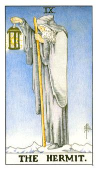

# IX.隐者

这张是术法之神，贺密特，这跟权杖相传是摩西的权杖，具有法能也就是愚者拿的那根杖，只有一只脚，另外一只脚挂跨界寻找知识，灯是所罗门之星，又称之为大卫之星，星星发亮地方可以带他寻找真理。他处在山顶上，代表他已经尝尽人世间的繁华，他想要远离尘嚣，去探寻真理的思考，并且拥有自己的想法没办法与世俗做融洽，这张牌代表自己的想法独树一格。这张牌又代表出世，代表和人的部分无法做接洽。柱子接地代表他须从地下吸收力量，否则他便无法继续作思考与沉思。9号人其实是很全方位的人，可能在高层也可能在低层，理想值的模式。这张牌也代表着经验的传授。

PS:6角星代表所罗门之星：阴阳调和、 7是天使之星、 8是天狼星也就是伯利恒之星，就是希望之星所谓的指引之星。

术法之神，处女座，是命术里面的贺密特，水星的老师，在帕德嫩神庙里面的偷道之神，最睿智最聪明的。最具有仙气和灵性的星座。这是摩西的令牌，曾经是一国之君的象征，他退隐山林，所处的地方就是圣山。灯里面的就是戴维之星，所罗门之星也就是六芒星。这个人像是铁拐李的状态，内在是孤单的，求道的意志是坚决的。他在找他内在真正的理想和向往的地方，也代表人际关系里面的薄弱，代表他社交能力很差。不愿意和别人同流合污。不合群的意思，追求内在更深层的部分，没有找到自己的人生哲学。

逆位: 同流合污，走入凡间或者是核心才能够完成。混着和思维不良。

牌义比较：
女祭司: 世界是黑白两面，所有事情都是比较单纯，没有东西可以影响她的思维
