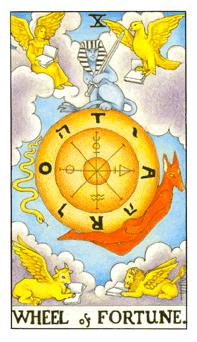

# X.命运之轮

向左转向右转，强调是你个人的想法。中间的轮子拿掉十字的部分则上方代表水星符号代表的就是汞，右方则是代表硫磺，下方则是溶液水，左方则是代表盐在表生命力。在外围有个TAROT，在埃及里面的王者之书，另外四个符号代表耶和华的四圣名字母。老鹰代表天蝎座水向、天使是水瓶风向、狮子座、金牛座，这条蛇就是古蛇萨迈尔，胡狼神承接着由死道生，斯芬克斯代表掌管人一生的锻炼代表智慧。这张牌强调强烈的馄饨效应与蝴蝶效应。这张牌对照着行星是木星，是吉星是好运的开始。1+0代表用这把钥匙开启这个秘密。

四本福音书(马太、马可、路加、约翰)，要知道魔的状态，要找圣约翰所写的启示录。

东正教的象征比基督教更强大，因为他们的力量是整个放射出去

代表一个酝酿的过程和结果。它是一个惯性行为和启动点的改变，因此变化多端，谁也不知道何时会改变。深黄色是内在的浅意识，或者是上一辈子的事情，一个概念的产生，时间点的配合撞击之下成真了。有六只动物，斯温克斯拿着宝剑以天启的智慧来控制一切，巨轮的下面的则是阿努比斯(Anubis)，死亡之神，托着这个巨轮朝上升的状态，从死到生，告诉当事人一个状态，命运之轮一但进来就会改变。古蛇萨迈尔则是代表生到死，整体看起来就是三方循环的状态。蛇则是代表着蜕变，胡狼神则是把地狱之门打开让你在重来一次。胡狼神守护着死灵之门。还有四只动物，都拿着本书代表着是基督的忠实使徒，四部福音书，马太、马可、路家…等。老鹰代表着天蝎座，人代表着水瓶座。整个运作状态就是获得。转变不是凭空而来，曾经在某个时间受到刺激，当机会点来的时候受到某人引导，而去达成的状态。在原始的点里面开始引动，开始去改变。四个固体的黄到十二宫来看管着。天蝎座代表着是水象，水瓶座代表风象，金牛座代表着土象，天蝎座代表着水象。整张牌有物质界上的自由。个人成长面的改善。TARO，它又回到T代表着一个循环，它叫做王道之书，王到之书的整体运转，掌握王道之书的秘密，四个犹太字母，代表着”耶和华阿”，也就是一个好的咒语，中间的圆心代表着贤者之石，右边代表的是硫黄，即是铅丹。上面是水星的符号，水银汞，左边那个是盐巴，下面是溶液。盐巴是有机体的代表，这里面提炼的就是把生命炼出来，俱有生命力。所谓的峰回路转。外来的助力对现在有一个帮助，有一个贵人或推力来帮助你回到轨道上。这张牌也是代表着大好。这张牌的代表着木星，十行星里面最吉祥的行星。

逆位: 不在是由死到生，运势相当柔弱，从高峰开始往下走，失败机率挺高的。不要去做大的变化或者是尝试。凭着直觉去做事的人，要小心机运差，把比较不好的事物往你这边走过来。所有的东西都朝着自己不愿意的地方发展。告诉当事人凡事以不变应万变。要知道它会转到哪里去，转到什么方向。
