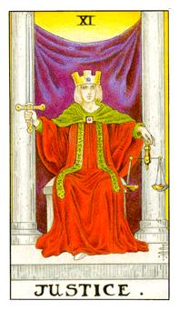

# XI.正义

这张牌代表着天秤座，从表面上看可能是男也是女。手上的剑是制裁之剑和加百列借的，冠上的宝石方正代表稳定蓝色代表智慧，这张牌是愤怒的正义女神，玛雅特，看的到东西不是真的，要用冷静地去判断，紫色的布幕代表智慧，学问柱子都是灰色的，因此他需要做正中央做评断，红色的袍代表热情，绿色的袋子代表着荣耀，圣殿的所在，就是女祭司的另外一面，把最后面的黄色想成太阳光，阳光透过布幕做传达，这张牌代表是非，去做公平的评断和取舍。这张牌也代表着他守护他自己的原则。1+1=2最大的困难点是他表面上看起来平静但是内在其实澎湃，没办法去做整合。他必须得自己做平衡。

不论是男是女，定位成女生。她坐上这个位置，后面的紫色布幕是上帝的天启，能量透过布幕传送给她，正方体代表着土的元素，稳定的状态。这里的部分代表着稳定性很足够，不会受到外界的干扰。正方体的中间有个点代表着元神或炼金石。绿色的披风代表着荣耀本身或状态。她坐在一个审判的位阶上，所有的部分都不能再靠良知，而是需要依靠律法。这两个柱子代表着进退之柱，主轴是取舍。这炼金术的丹在这里，必须去承受，去相信她所相信的东西，代表着一种决断力，绝对的原则是什么。公司的制度或者是规定，容易和法律牵扯关系。这张出现可能代表着纠纷或者是偷窃、伤害，而这些罪尚未被判定。正义的出现会得到一个合理的公道。

逆位: 挟持她所爱的人，她失去理智的状态，她内在有很多奇怪的思想。这个人可能代表着贩毒一些比较糟糕的事情。取舍不宜和实际的收获所得不对，她的想法没有很客观很公正。永远看不到自己的错误。原则点丧失，进退的状态该去找到。
