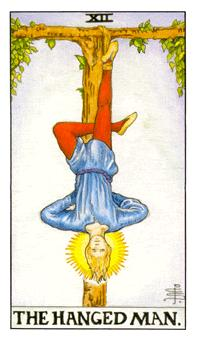

# XII.吊人

崇尚牺牲之道，古名称又称为寻道者，由于他是异教类的牌，这副牌所涵盖的是奥丁，奥丁吊在生命之树9天9夜，同时奥丁又是偷盗之神与术法之神，他倒吊时拿得北欧符文，他抓到卢文便开始运用。期待被牺牲掉的伟大情操，头在发光是结晶体的所在，因为是冷却后沉淀下来所以用冷色系来表示，12号吊过来便是21号牌，这张牌是通往世界的牌，修练成功后便可以在世界中来去自如。这个腰带最后会张开成为围住21号牌女神的腰巾，这颗生命之树是活的，代表着积极的去面对，站在别人面前去告诉别人你所知道的，去练习口语上的表达。这张牌代表着海王星，卑善与慈善之星，双鱼星的守护者。绑住一只脚，到4的符号代表着正在运作当中。

圆圈是灵性界，Ｔ字型是物质界，这张牌也称为参透悟道。倒吊公法，把灵性物质转成非灵性物质。身体的蓝色代表着稳定性，血液不会往下流，让头能够清醒的思考。头代表着最后的过程，第一阶段红色的部分就是琉，琉汞不断的循环和刺激，到最后变成结晶体，就是他的头，一个发光体。这张牌也代表着绝对的寻道者。这张牌代表着海王星，绝对的牺牲和奉献。

逆位: 心不甘情不愿，牺牲奉献到一半，游戏不玩了，不做了。心理面是不服气的，他并没有对状态产生认同。