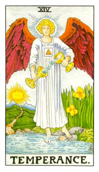

# XIV.节制

代表星座射手座，火之天使(炽天使)麦可、米迦勒，积极的进取，中间的三角形火元素外围的方形土元素，两个杯子代表着协调，用协调的方式去和对方沟通，脑袋发光代表着结晶的所在，身上是白色纯洁的白袍，右边的花是鸢尾花代表着骑士的荣耀。这张牌代表着水火既济，左边的部分是圣山，也就是耶路撒冷的所在。皇冠即是卡巴拉三角形上的符号。

东方天使，米迦勒(Michael)，火之天使。土元素代表着稳定，中间的三角形，代表着火元素，火在稳定的窑里面烧，是非常的旺盛而且稳定的。节制在最后一张，自己知道自己的能量和定位。池子里面的部份代表着浅意识，一个脚在岸上则是表意识。循着路倒走就可以走到安稳的状态。炽天使，红色，和6号牌拉菲尔一样，头部是他结晶体的所在。水火济济的64卦，济济挂，最好的卦象。这张牌代表着积极的控制，所有东西都在掌握当中，用尽所有办法去掌握这些能量，他的积极度很高，去完成最好的效果，他没有所谓的懈怠，他要完成那个定位点。他一定要很到位，他一定要到一个标准。要去积极的调整和运作才会成功。这里的主导权十分具备热力，不是强迫性。在轻重之简，前后之间去抓到节奏。节制牌是射手座。

逆位: 太过于被动、不积极、被掌握度比较高。主动权都在别人手上不能克服当然心力交瘁。水火不济的时候，都没有去交流，就是太阳刚或者是太柔弱。

- 塔罗三幻：牺牲之幻(吊人)、物欲之幻(魔鬼)、存疑之幻(月亮)
- 塔罗三光：日月星
- 塔罗三道：机运道(命伦)、原则道(正义)、牺牲道(吊人)

牌义比较：
比较力量牌含意有什么差别？力量牌控制自己的内在和力道，由自身内在去调整最好的状态，去调节自身最好的状态。他内在兽性非常的强大，用女神智慧去控制，这张牌又可称为征服。只要能够和狮子的欲望成等值就可以无限的成长，如同头上的无限成长的符号一样。
节制牌则是一个光体，一切都调节好了，他自己本身就是完成体，他到哪里就可成功，自身调整完成，对外才发酵。
力量牌是创造中，节制牌是完整中。
