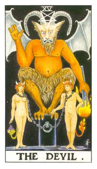

# XV.恶魔

代表阿斯莫帝斯，欲望的代表，和恋人牌一样都是呈三角形，七原罪之一，这七罪也对应着七个恶魔，也有所谓的七元善，有角的部分通常都被视为怪兽或灵异体，代表着强大的力量，五角星代表火风水土逆行，羊角代表力量的象征，水星有脚代表力量值，翅膀是蝙蝠翅，在天使战争时烧毁造成的，这只恶魔站在立方石上面，链子套住男生和女生，链子很松，但他们堕落到欲望里面不愿拿下，女生的屁股长了尾巴，葡萄代表贪婪多子，很多种欲望和想要的东西是贪婪的果树，男生后面的是火，代表他的欲望很强大，随时都有攻击的东西和想要的东西，这支魔是女生，下方面是阴道口，她的毛盖住了，代表她的罪恶可以由此处诞生。蓝色的火把代表他有谋略的进攻和侵夺，手上划十字幅代表欲望实质的取得。

手势代表着物质跟权力这两点，这张牌也代表情色和不接受道德的状态。

PS:所有天使与神父都诞生于虚无，路西法在第一次天使战争还是正派，守护东方的是拉斐尔代表风，南方是米迦勒代表火，北方是加百列代表水，西方是屋列尔代表雷，战争结束后才有地狱，地狱之火把他们的翅膀都烧光了，也因此他们创立三头犬，第二次的战争是路西法的带领，不服输的个性代表着骄傲。

塔罗有三德，原本有四德，四德便是谨慎后来不存在。

旧约讲的是摩西与先知，新约便是耶稣；天主教才有天使，基督教没有天使。

很物质的爱情，情色之爱，肉欲的状态，强大的诱惑性，从灵性转为物质。中间的恶魔即是魔鬼阿斯莫提斯(Asmodeus)。用物欲的概念去涵盖非法，强大的欲望也可以说是奸商，为了达到目的而不择手段。炼条很松为什么不拿下来，因为他们甘愿堕落在这地方，堕落的概念存在。黑色的立方柱就是神秘魔法石，提炼成黑色成为能量的来源。葡萄代表着多产多子，意思是贪婪，男生的后面则是欲望之火，纯粹只是不断的去追求，性欲、财欲的代表，恶魔之火不断的提供无法熄灭。恶魔产生出来的都是罪恶，恶魔之子。黄道十二宫的魔羯座。土星的概念就是物质与物产的概念。突破道德规范，做自己想做的。不是真正的爱而是占有的爱。

逆位: 邪恶的计谋或者是心境上不敢直接面对，他把邪恶藏在心中不敢执行。解开罪恶的束缚。

地狱七大魔王: 路西法(Lucifer)、别西卜(Beelzubub)、萨麦尔(Samae)、莫斯提马(Mastema)、亚巴顿(Abadon)、阿萨滋勒(Azazel)、彼列(Belial)。

神话轶闻: 萨迈尔原本是七大创造天使之一，而且人是由他所创造出来的，神因此给予他掌管人生命的权利，被称之为「死亡天使」。原具炽天使位格，为身负十二枚羽翼之蛇型天使（炽天使的形象便是蛇）。因为他不肯跪拜于亚当之前，并说出：「凭何要我这圣火所生的天使，跪拜一个尘沙造出的身躯。」之叛逆之言。发动第一次天使战争，当时亚当和夏娃诞生于伊甸园，他向天界的四大天使挑战，其中有七大天使的翅膀被烧光，被地狱的影响长出了角，鬼的象征，因为他代表着力量。同时也被剥取名号，而成为唯唤「古蛇（The Serpent）」的「禁名天使」。后来萨麦尔娶了亚当的原妻－－莉莉丝(Lilith)为妻，她成为地狱的女王，也被称为夜之魔女。

第二次的天使战争是路西法(Lucifer)领军，引发著名的天使大战(War of Heavens)攻打天父，带走了全天堂三分之一的天使。因为天父不派他到人世间而是派他的代表，耶稣下凡间，同时也被耶稣夺走了晨星之名。
