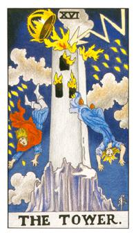

# XVI.塔

巴别塔，W代表的是伟特，他是这副牌的创造者，不满于当局的状态，希望他自己有能力去改变这个状态。皇冠代表着权力和荣耀被雷打吊，三个窗口代表着身、心、灵皆被摧毁。22个光点代表着大阿尔克纳都会遭到此劫难。满招损，谦受益。这张牌的出现事出必有因，必须帮他找出问题。1+6和数为7，代表着太过专注，旁边的事情开始酝酿却没有被关注。把能量都用光了，所遭遇到的是能量的反击。这张牌代表火星，暴怒和杀戮之星。

本来上帝再造人时，语言是共通的，一直合作的去发展和进步，当他们能力越来越近神，人类开始不信仰，便开始想超越上帝，上帝并命令雷之天使屋列尔把这座塔摧毁，把它们分不在五大洲，让他们去互相攻击。

北欧的净火驱除咒，冰岛诗集和艾达经。

每个人都勤勉工作，人口兴盛，当人们想象上帝长什么样子，建造巴比伦塔，见到上帝之后，上帝很不开心，就把塔打掉，人就变成黑人了。绝对毁灭的能量，皇冠代表着教宗，这张牌是火星，是凶星，讲一个概念，长久以来就自以为是没有问题，就会在塔牌出现的同时，会跌倒瞬间毁灭，累积的高度瞬间崩毁。妳越是在意的地方就会出现危机。有突然的意外将会发生。一直习以为常的事情，要多加注意，会出现错愕感。这张牌可能会出现血光。所有的建设都需要破坏，如果不去破坏又怎会有新的开始。要注意每天的习惯，因为意外总是突然而来。破坏后的建设。

逆位: 代表小小的革新，并没有连根拔起，可能代表没有救。可能只是小小的破坏。需要小小的改变一下。事情不断的被腰斩。
