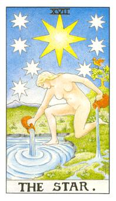

# XVII.星星

八芒星又称为北极星、天狼星，7颗星加上1颗黄色的星代表八的力量，但他的力量比8号牌还强大，脚上踩得这地方是伊甸园，甚至是更高阶的地方，右后方有一只生物他是朱鹭神(另外一个是狒狒)负责记录，两个葫芦代表，过去和现在的存在，绿色土地上是人界，把水倒入人间有5条支流，分别是五觉。这张牌也可以说是张女神牌。最大的黄星代表希望。

大星星旁边的是北斗七星，希望的和指标的概念。上方最大的星星就是天狼星，伯利恒之星，圣诞老公公准备出发的地方。女神的概念，生命之池，生命之湖，水从湖上面吸上去，从大地中流出来，灌溉大地。旁边的小鸟朱鹭神，智慧的代表。水流入大地代表着五感。这张牌代表着位阶不同，单纯的就是你对我好，单纯的友谊，在爱情中这女生不好追。水瓶座的代表，不对的人总是没用。水瓶座男生最有自己理想和自己想过的方式，当对方不符合他的时候他选择爱自己，而放弃对方。正面的人生观就是希望。这个人如果太过于悲观容易抽到星星牌，他是一个心灵疗愈的力量。可以在自己的轨道上前进。麻木对方的邀约。

逆位: 这好意并非单纯，不能把自己当神，必须去当人，去理解对方的好意。很有希望的模式被肮脏化，或者是多余的动作让事情不顺遂。简单扼要反而好。
