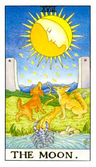

# XVIII.月亮

15个光点代表着魔鬼牌，在古塔罗牌义里面，三幻：吊人、魔鬼、月亮，两边的真理之塔，就是死神牌中的那两柱，螯虾走的那条道路叫做真理之道，经过狼和狗中间，龙虾代表浅意识，内在和外在的整合，通过幻觉的考验。这张牌与精神很有关系。黄色的狗代表铁，红色的胡狼代表锡。这张牌具有怀疑、猜忌、不安还有焦躁。月亮的大小芒共有16个。

狗神和犬神分别代表着铁和铜，蝎子或者是螯虾，螯虾是浅意识最大的幻境就是最恐惧的想法，要去面对真理之道，要走向圣山，代表着绝对的自信，只有经过人生修炼的道路才能成功，每个人都有强大的恐惧。路途上会遇到很多阻碍，必须相信走到才能达到圣山。没有走到尽头的人生并不会快乐，造成的原因可能是幸福、权利、家庭…种种可能，必须具备信心去克服所有的阻碍。月亮代表着阴晴圆缺，有好坏，这时候可能会做恶梦之类的。最大的是怀疑、猜忌、隐瞒或者是欺骗，真相未明的感觉。这件事情没有表面上看得如此容易，他需要经过考验才能够被理解。月亮不断变化也感觉哀愁。月亮牌代表着双鱼座。双鱼常常怀疑自己，存疑自己。做到最好给别人看，就是谎言和不安。

逆位: 结果会出来，妳怀疑、猜忌的东西都会了了分明，不管是好还是坏。问什么都可以很快知道答案。

牌义比较：
宝剑7是小人，投机取巧。但是月亮则是隐瞒更加可怕的事实。对自己的信心不够、多忧虑、忧愁。