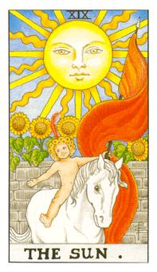

# XIX.太阳

有四朵向日葵分别代表四大元素，孩子的花冠上有12个代表黄道12宫，太阳则有21道光芒代表着21张大牌(扣除愚者因为他即是小孩)，小孩子即是原神，后面那堵墙是耶路撒冷的哭墙，这道墙的后面是圣界，前面是人界，红色的布帆是所有红色的集合点，棍子即是愚者手握的权杖，这副牌把所有的元素做一个统合，所有的状态在这里整合成功，白马又代表着纯洁。小孩的头巾与前生死神还有后生愚者息息相关。

神的概念，最后的元神。躲在本心元神，可以返老还童回到最原始的状态也代表着所有的成功。成功应该是给人幸福的，像冬天的太阳一样让人感觉温暖。如果让人妒忌或者是憎恨并非成功。因此我们下定义为冬阳，四朵向日葵分别代表火、风、水、土的聚集点。这红色旗子的标竿就是摩西的令牌，也是愚者和隐者的令牌代表，代表热情和重生的概念。这匹马和死神的白马分别代表着灵性和召唤。11道是直的10道是曲的。在塔罗牌里面代表着阴阳的状态。这面墙是位于耶路撒冷，炼的是物体穿越术。这个代表的是真正的成功，如果问的是一件事情就表示这件事情的进展绝对顺畅。询问人际关系如何代表这爱情会令人称羡。不要成为夏阳也不要成为春阳唯有真正的冬阳才会让人想接近你。俱备影响力和热力的传染，他被很多人看见，不单单被一个人看见。他的成功来自于感染力和渲染力，他的状态来自于和人何善得到最好的结果。代表太阳。

逆位: 太阳倒下来，代表过度放纵或者是行为举止有点过头也可能是任性。过了事情就不单纯或者是不明亮，让人感到恶心和厌恶。过度去执行自己的事情让别人觉得这温暖不舒服。一瞬间的成功不代表永恒，失败即将到来。

牌义比较：
与死神做比较，太阳头上有红羽毛，死神上面也有，愚者也是。就是人生的成长，太阳是重生，愚者是炼法，死神是酝酿重生的状态。
