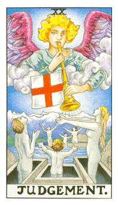

# XX.审判

加百列的号角唤醒了躺在棺材里的灵魂，被吹醒的两组人马都有爸爸妈妈小孩，代表救赎完整。整个合起来就是六芒。审判代表着冥王星，浅意识之星死亡之星。棺材里面还有着肉体，意旨精神提升。

北方天使加百列(Gabriel)，身上的红十字，十字是救赎的意思。在圣战里面不断的见血，在这危险的状况下去为别人奉献。红十字在西方的概念就是以牺牲自我去帮助别人的模式。吹着号角是救赎人的模式。一家子三个人所组合的是正三角和倒三角的模式，正代表着阳性，逆代表着阴性。六芒星的模式是以色列国家的国旗，戴维之星或者是所罗门之星。地球不论是五角还是六角都是最大气场的存在。背后所代表的是圣山，炼狱篇，炼狱的代表状态是所有灵魂接触到审判，暂时在炼狱篇里面待着，不管如何这两家子人在这边得到加百列的救赎。在托特系统里面就是轮回因果的关系。伟特系统则是团体共业的状态，一人得到道全家升天，这个人必须去投入去救赎。这是从实体到虚拟，这六个人两男两女都代表着精神层次。这张牌也代表着必须整体提升。代表冥王星。

逆位: 不断的向下沉沦。没办法在最短时间里面提升上来。很难以得到救赎的状态，当下的状态卡在某个点走不出来。
