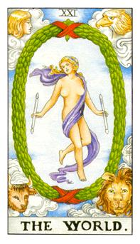

# XXI.世界

天蝎、水瓶、金牛、狮子，四元素的整合当他的守护者与命轮相比，可看出者四个固体星座已经修练成功，也代表着实质的稳定度，她拥有两个乙太，代表她法能更强大，更稳定。紫色的缎带也是吊人的腰带，雌雄同体，不肯透露出性别，她练的公法就是时间穿越术，代表着悠游自在。最大的桂冠代表着最大的荣耀，0的状态，代表不需要再发展，她本身就是一个强烈的完整直，归回虚无的状态，在0上面绑着一个8字的无限符号，最极大值的强大力量。

魔法就是想像的巨现化

- 三光:日19:成功 月18:察觉 星17:希望
- 三幻:吊人牌:自以为牺牲奉献能得到一切；魔鬼:人生就是一场梦、月亮:所有担忧都不存在，怀疑论现在比过去更重要。

三光分别是星星、月亮、太阳，灵性到内在的自我去结合起来，这张牌就是自由。世界牌的象征是女生，紫色的布幕遮住的部分是阳性的部分，所以说他不缺女不缺男。命运之轮上的四圣兽来到这里已经修练成功，四个固体质不需要阅读福音书，守护在这光环里面。这个环就是莫比尔斯环(Mobius Strip)的概念，空间曲折的概念，可以跳跃空间的模式。以太是一根是虚拟的，战车也是一根，可是在世界有两根代表着他的需求比较大，控制能力比魔法师和战车来的更高。这张牌也是纯然的自在，这是真的踩实还是踩空，是否真的有重量? 空间折射是可以像镜面转，类似于任意门，可以到自己想去的地方。这张牌代表着实体的最高位阶就是土星。体积最庞大的行星不会再去改变。这时候的状态都很顺遂，他的支持度十分的长久。就算没有成功也不会因为别人的影响或者是批评，而导致自己情绪上的起伏，一个完整而稳定的模式。他的领域做的非常完整，老板无话可说。问职业的话比较偏向于自由业、舞者、SOHO族。这张牌可以用来祈福是白魔法的一种，一切都会越来越好，引动未来的结果值会如何改变。只要相信自己就可以轻松面对这一切，这是稳定的不会受到其他人干扰。这张牌不会受到物质、名利、权利或名声而困扰，他不受到其他外在事物的干扰。狮头、人头、鹰头、牛头，不再看书，因为它整个都自由包括心灵和物质。

逆位: 事情没有这么容易得心应手，暂时的不顺遂。因为四个元素中有个能量跑掉有缺口而造成的损失。

比尔斯环(Mobius Strip)：人生就像是一条漫长的道路，起点即是终点，不管你怎么走最后还是会回到原点。
