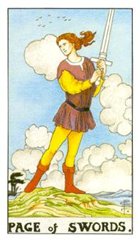
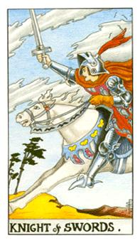
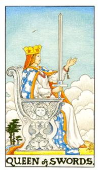
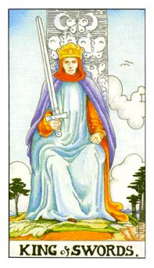

# 宫廷牌

- 行业：研究者、教师、律师、医师，需要专业背景的人
- 体态描述：身形较高，身材比较纤细。

| 宫廷角色 | 年龄 | 角色     | 星座 | 属性 |
| -------- | ----- | -------- | ------ | -------- |
| 宝剑侍者 | 25~30 | 青年     |        | 风中之风 |
| 宝剑骑士 | 30~35 | 年轻男子 | 双子座（变动风象） | 风中之火 |
| 宝剑皇后 | 35~40 | 母亲     | 天秤座（本位风象） | 风中之水 |
| 宝剑国王 | 40~45 | 父亲     | 水瓶座（固定风象） | 风中之土 |

## 宝剑侍者

邮差，代表新讯息与好讯息，破格的剑从天接收讯息，红色的靴子代表行动力，身上的黄色代表着土元素。好奇，新鲜，希望，刚开始进入某种领域，讯息的传递。专业可能会代表快递，邮差。好的讯息要传来，信息会使生活发生好的改变。工作或感情。

逆位：方向不对，没有好的讯息。把自己困与圆中，没有方向，如有事业上的帮助（出口）或如有感情的出现（出口），很容易马上大量投入，失去理智。

## 宝剑骑士

风中之火，红色的鸟，会飞变得更快，白马代表纯洁的理想值，骑士身上还有鸽子代表着灵性的升华，骑士代表着计划的谋略者，30岁上下，口中呐喊着冲刺，宝剑出格，承受天启的力量，他所做的动作都是理想值。代表双子座。缺乏实际感，动能够，自我感觉良好。6~7月是吻合的时间，看他所说和所做的是否一致。

宝剑骑士对自己的未来充满希望，是一个有目标和有干劲的人。在感情这块比较自私，在他的眼中只有他想要的东西。骑士身上的蝴蝶代表他是没有定性的他可以上路。宝剑骑士的背后，破碎的云代表着他的意念十分动摇，成熟度不足够，但是他也代表着他不断的学习。快速变化，设计，内部科学园区。对未来充满希望有干劲。但是容易忙于自己的世界，忽略身边的人。义无反顾的向前，有方向性，现在的前进方向很正确，想好放大执行即可。

逆位：执行度低，说的好，做的差。所有计划受阻，阻力扩大。努力去提高执行度，需要贵人相助。

## 宝剑皇后

赐你免死，孤寡，代表天秤座，红色手穗珠代表庇佑别人，发冠是彩色的蝴蝶代表着她其实还有女性的温柔，脑袋里有幻想和梦想只是不容易展现，她没办法放下自我道德标准，才会导致孤独。小天使代表灵性的升华，有上弦月和下弦月代表生命的多变，云代表着纯洁与多变。30~35岁的女性，风中之水。

不敢正面面对任何人，因为他面对的话他会看见人的情绪而心软，因此他侧面看着人，避免开到人情。刚强果断的女生，理重于情，不能接受谎言。剑后侧脸造型，不忍去听，假装坚强，决绝，讲道理。（币后和杯后均是45度脸，杖后正面），孤寡，寡妇命，难于去协调与包容。对于情感奢求度不高，不肯给别人看脆弱部位，暂时不能找下男朋友。或者需要一种强势的执行模式。

逆位：刀子嘴豆腐心，不利于做决定，舍不得下狠心，容易做错决定，不利于幸福，控制言语模式，与母亲或长辈比较纠葛，有委屈感。取舍不易，或者想要去变的很有原则条理但是无法达到。

## 宝剑国王

宝剑风的元素的代表，蝴蝶随风飞，被动随势而发。，鸟类都代表风，因为它会飞，风是会飞的倾向，不苟言笑，头外面有红色的围巾，他对于事物还是具备热情的，紫色的袍代表高智慧。蓝色代表冷静，他是不动如山的传授者，风中之土。他的天启力量引导的天的力量，有些大原则都不可变，星座代表着水瓶座。风所处的地方是旷野，这边是生机盎然，这边空间大，思维是可以传递的。35~40岁的中年男子。

他的背后，即使刮着大风也不影响他的声势。专业领域高手（如王牌律师，名牌医生），律师，法官，设计师。国王风不动，他的情绪不易被外界波动。尊敬，正确的选择，有威严的，状态成熟。

逆位，自私，以自我为中心，不利于沟通，有可能是错的决定。状态。强迫拿掉面子走到下位阶，自尊受损，无法呈现个人特制，控制能力不够强大。与父亲或长者比较纠葛，长者的思维和要求在你看来不合理。
