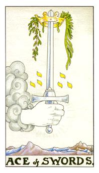
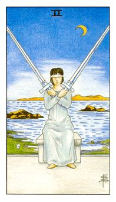
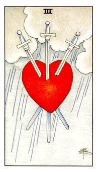
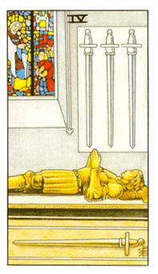
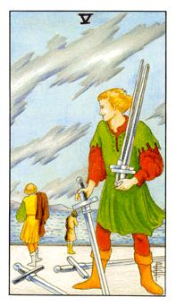
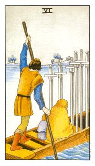
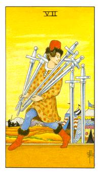
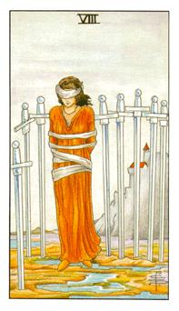
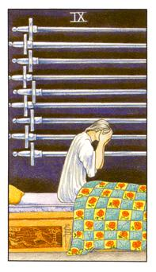
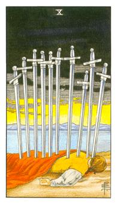

# 数字牌
风：无形、自在、不安定、讯息、灵性、冷静、绝情

## 宝剑Ace

心理面有一些节过不去，困在困境里面，必须做一些决策。这张牌决定下去，绝对是王道之路，要相信自己的直觉与选择。圆桌武士中，亚瑟王的石中剑。3+3=6 正三角与逆三角，完美主义，有期待值在。从云里面出现的手，突如其来的状态。圣地耶路撒冷的所在。现在所做的决定也影像未来的日子。宝剑是锐利的，感情的头号杀手。他配上有生机的绿叶，因为你的决定让事情产生生机。

云的左手边伸出上帝之手，上面带着桂冠代表着这个决定是正确且荣耀的。在圆桌武士中，国王把宝剑放在人头上代表着封爵。二选一发展中抽到这着牌代表着这决定是正确的。在感情中抽到这张牌，代表着这决定是好的。不论在任何的选择当中出现这张牌都是正确的。左三个光点、右三个光点代表着平均，这光点是Yed上帝的手指，三三六代表着柏拉图的理想国，同时三也是放射，这三个代表着一个理想的状态。但是出现在感情方面可能都是代表该了结这段感情。

逆位: 剑都往下了，代表现在的决定和想法都是不对的，太莽撞鲁莽的。所以这样的模式是不正常的。假设问我是否该跟她在一起，抽出逆位，代表不要相信自己的决定，要倾听他人的建议。

## 宝剑2

不要看事情的表征，要试着去探出深层的东西，跟着自己直觉去做。他也代表着防卫，对面当事人需要持保卫的状态。

PS: (宝剑2)黄金黎明里面，密契仪式，这个人在女巫之夜，农历26日左右，力量快消失之前，女生接受考验，后面是智慧之湖，一把智慧、一把判断，把她的八感全部封死，双窝提(眉心和百会成为直角的位置)，开启直觉力的地方，用嗡音达到双窝提的震动，达到更大的直觉力，牌的意思是说是要开启这个人的直觉力，若能够她在这里能待上一个晚上，即能入会。

在夜黑风高的晚上，她会听到狼嚎，造成她内在恐惧，她蒙上双眼，用心去感受，到底要不要做这个决定，阻碍外在的讯息。跟着自己的直觉走，做出自己内在的决定。

逆位: 全然的接受与全然的放下，因为他已经不再蒙住自己的双眼

## 宝剑3

伤心，劳心、劳力、劳神，三剑插心，代表心结的状态。

辛苦与纠结的状态，简单说就是伤心，让人感觉不舒服的状态。可能因为朋友、家人、感情而忧心，劳心、劳力、劳神，所以是非常疲倦的状态。

逆位: 宝剑掉下来，伤口都还在，复原当中，这三把剑都脱离你的纠葛，过往的记忆和伤害都会有烙印，随着时间都会愈合，慢慢地去修复她。

## 宝剑4

骑士的功勋，卸甲归田，功勋都挂在墙壁上，他躺着代表着他安息，他背后的彩绘玻璃，是一种传递的模式，代表着她回到一个温暖的怀抱里面，这张牌又可称为小死神。短暂复活的方式和模式。在感情的部分，走到这里已经是情尽了，两者之间已经淡薄。

又可以称为小死神，一切的东西都冻结起来，这个人形光是牛顿，她是光荣骑士的退影。所有的东西到这边都必须停下来，有点像是进入冬天的状态，一切都需要休息。

逆位: 一切停止的东西都复苏

## 宝剑5

涵盖强大的杀伤力，损人利己，这张牌也意味着官司和诉讼。背叛与强烈的争执会令人感觉不舒服。

很强大的杀伤力，厮杀。口角与律法上的关系，所有的人都会经过争吵与分离。大家互相斗争的过程。主轴在于人际关系上面失调，最近可能会和某某产生争吵或者是口角。你用自己的专业能力把其他人都赶跑了，看似你赢了，但是一个人不能完成整个案子，到头来还是输。也可能代表你不太会经营人际，没办法圆融地去处理人际，总是用说理的方式而少了情感。

逆位: 很多内在想法不敢表达出来，很多的不公平与不尊重都不敢吭声。或者是环境中有人用不正当的手法对付你，也就是要防小人，或者是有人在背后对你放冷箭。

## 宝剑6

低调地去进行计划，水的两边一边波涛一边平静，代表他是低调的，注意牌上面的人物，判定问卜者的脚色。划船者，代表着他处境很危险，快速的振奋起来，快速度过危险状态。乘船女性者，安然地听从指示。

在但丁神曲中，很多人会挤上去，上不去的人就会被鞭打，三三六在这里必须沉静，宝剑往上代表这讯息是对的，反之往下则是不对的。其实画面中的人士非常小心翼翼的。两边的水一边动荡一边平静，代表说必须听着沉船者的话，让这件事情慢慢地去执行。或者是不要和这件事情扯上关系，方得安然度过。或者是这件事情表征上很隐密，但是我们还是必须要进行，如同鸭子划水一样，很潜行的低调执行所有事物。

逆位: 船沉了代表这个环境里面没有人能逃得过，感情里面这次的争吵不是只有你受伤对方也是很不舒服。这件事情也牵扯到与你相关的群体。

## 宝剑7

投机取巧，代表他知道事情用法，但他却用诙谐的方式看待。这个人不务实。偷了争吵，留下直觉与判断，他认为这样就好，但事实并非如此。过度乐观与评估不够确实。没有把事情看得很透彻。

代表着这个人可能是小丑，她可能是想把一些道具拿掉，轻松面对的接下来的工作，不肯很确实的去完成它。也代表着一种投机的心态，这是一种有危险性的。也代表着有未知的风险准备引爆，说谎的人与不够诚实的人。

逆位: 代表东窗事发，事情已经都发生了。所想做的事情都被看穿了，必须诚实的面对她去处理她。

## 宝剑8

困局，8把剑里面都不是别人插上去的，作茧自缚，多余的担忧与忧虑都自己想出来的，并非事情的本貌。

中间的人被八把剑所困住了，这个人或许还可以尝试这个危险，脱离这个困境，可是他为什么不动? 他用了太多的忧虑，每把剑都是一个思考或者是决定，让他动弹不得，一切都是自己作茧自缚。这个时候他的完全没办法接受外来的讯息，受到自己的内在的想法困住。告诫当事人做就对了，不要多想。

逆位: 脱离这个原始的设定点，脱离困境得到新的资源，当下的疑难杂症终于解开了，但是这只是他暂时得到舒缓而不是完全的解决。

## 宝剑9

噩梦牌，精神涣散牌，因为害怕而睡不着，这代表忧虑与烦躁到达顶点。

心理的承受压力已经到达临界点，当事人可能把这件事情看得太严重了。

逆位: 噩梦不止，永无止尽的恶梦，代表当事人的心理压力太大。在不去解决很可能会躁郁或者忧郁。

## 宝剑10

是自己造成的压力到极致的状态，过度强求的结果。

告诫当事人要全然的断舍离

逆位: 否极泰来，所有的剑都掉下来，事情逐渐好转
