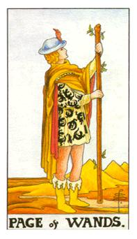
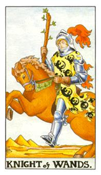
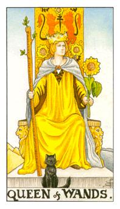
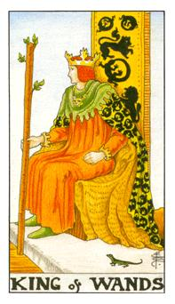

# 宫廷牌

- 行业：行销、公关、需要与人面谈的工作、行销、企划、SOHO族
- 体态描述：身高是170~175cm之间，身材前凸后翘。

| 宫廷角色 | 年龄 | 角色     | 星座 | 属性 |
| -------- | ----- | -------- | ------ | -------- |
| 权杖侍者 | 25~30 | 青年     |        | 火中之风 |
| 权杖骑士 | 30~35 | 年轻男子 | 射手座（变动火象） | 火中之火 |
| 权杖皇后 | 35~40 | 母亲     | 牡羊座（本位火象）| 火中之水 |
| 权杖国王 | 40~45 | 父亲     | 狮子座（固定火象） | 火中之土 |

## 权杖侍者

握着这跟权杖，权力的象征，代表着小组、干部，接了一个新的事物，那根棍子代表着人事时地物的对应。侍者的蜥蜴连尾巴都偏调，成熟度的不足，他会很小心地去保护他所刚得到的权利。火中之风，我尝试。年龄代表着20~25岁。

希望每个工作都很好玩，三座山分别代表位阶的迁升，权杖对自己的未来和目标有新的定位，但是不知道该怎么去设定。代表心绪上是移动的。代表一个进展的模式。他必须很慎重的看待目前的工作。去仔细的揣摩这东西，严阵以待。

逆位：他没有去执掌好他的工作，他找不到他的兴趣和定位点，原地踏步。算是工作失败。这个人当下并没有任何想法。很容易失去信心和感受挫折感。

## 权杖骑士

以年龄25~30~35岁，代表正在社会上努力工作的男生或女生，对照的星座是射手座，衔尾蜥没有咬到尾巴代表没有稳定，风元素会干扰他，火骑士的马是要动的代表迅速和行动力，代表着快狠准，不要拖泥带水。越过障碍，障碍代表着人事时地物的对应关系，传递性和侵略性很高。马旁边的绿色代表着荣耀，头盔的红色与穿着都代表着迅速性，穿着盔甲代表着准备好去迎向挑战。火中之火，我冲刺，快速地进行所有事情。

像是炉灶里面的火，温暖而不伤人，希望对方能够接受他的看法，这批马代表他的动能和方向性，代表成熟中的男性。他的权杖没有伫立在沙漠上，代表他不够稳定，对于某种事物非常追求，要快速的去进行，或者你对工作或者热情都非常有行动性。如果这份工作没有办法燃烧起你的热情，就放弃这份工作，断然的去做处理。是一个警讯也是一个提醒的方式。在爱情中代表放手且勇敢追求，展现出你的善意。

逆位：欲速则不达，代表他受到阻碍，没办法再继续进展。在爱情里面也可能代表假的追求者。

## 权杖皇后

向日葵是向着阳光的代表着热情，权杖皇后是热情的象征，猫是黑色的代表着灵界质，相信自己的直觉。权杖皇后代表着牡羊座，胸口是狐狸扣，狐狸代表聪明皎洁，所代表35~40岁，主轴代表保护力，有强大的母性特质。座位上面两边的两头狮子，红褐色的狮子，火狮子代表着铸造。牡羊的忍耐性是很够的，因为在铸造的过程中不断地有能量再干扰他，这张的主轴在性能力比较开放，比较热情。对于所有人的观点都是乐观的。火中之水，热情里面的水，类似于温泉，代表和他亲近的人是非常舒服的，保护性与照顾性，怜悯心很够，喜欢帮忙。

控制性、欲望 像是闪燃动作，男女都是奔放热情，很容易被喜欢上，所有的能量是开放的，接受付出的能量是开放的，很具备挑战与被挑战。黑猫代表的是牡羊，直觉性的星座，透过猫来看到不同的世界，他的钮扣是一只狐狸，狐狸代表他的敏捷和热情，两只狮子代表的是融炉状态，最热的状态，最为热情的方式，具有照顾值，对于感受和感觉都是十分明显的，牡羊给人的感受是直接而且了当的，他非常的热情而且他能量十分的开放，他感情的直觉性可能不会单一，这感觉消失了很快就会在去找下一段，这代表这感觉是百分百的投入。有母性的原型与照顾的原型。由上对下的一种帮忙方式。现在对爱情的渴望是开放的，随时接受爱情的进展。

逆位：情绪不稳定，或者是更年期即将来临。主管情绪主观，无法去做调整，主管可能变成很啰嗦很爱挑剔。吵架王，非常喜欢逗嘴。

## 权杖国王

火元素的老大，权杖是具有生命的，蜥蜴在埃及里面代表成熟的男性，火元素权杖国王，代表火中之土，土元素代表稳定安稳和实质，最稳定的火，代表稳定成熟的男性。衔尾蜥代表成熟的蜥蜴也代表着圆融，这张牌代表着狮子座，胸前挂着一个幅令，狮头幅令代表狮子座，权杖抵住沙漠就代表这是一个热力无限的地方，抵住沙漠的底端，热气从权杖中传送上来，蒸发里面的水气使叶子吸收到水气，使叶子继续增长。

火元素的特质只要目标锁定就是往前看指的就是专注，年龄约代表40~45岁。火也代表主掌者，火元素主掌着四元素的王，火也代表行动力和扩张性。具有强势的特质。这张牌的排序为狮子座、牡羊座、射手座。时间判定从7月21~8月21日。

源源不断的火，不熄灭的热度像是太阳，工作希望被尊敬，在火里面比较稳定的模式。黑狮子的原因只有1个，黑色代表燃烧后的灰烬，固体质。头上的火焰桂冠代表他的掌控性，背景的沙漠，证明他是一个火中之土狮子座的特质，项链上的猫代表的是狮子，旁边有一只小宠物，蜥蜴在埃及里面是一个火的代表，咬住尾巴的蜥蜴是成熟的象征。绿色模式代表荣耀，权杖代表的是权利，责任感很重。他的爱情是浓烈的，他会希望对方配合，对方所要的东西，他都会尽量给予且尽力去达成，绝对不会吝啬。照顾热情、给人温暖，因此不太会理财，他可能会视财如粪土。他代表他心里面有想要成为一个成熟，一个荣耀的对象，他希望被人称羡和尊重。

逆位：爱慕虚荣，没有那个实力要装出那个价值，他失去他的国家，他变的十分暴躁，他的火容易去去伤害别人，他的稳定性十分的差，他的承诺无法对现。对家庭不够照顾和责任感很容易出现逆位，没办法和对方沟通或者是控制欲很强。

牌义比较：

- 圣杯国王：是你想要什么我懂，我可以贴近你要的要求。他会安排一个假期，想给对他一个惊喜。他会主动去理解对方的想法。对方只要感觉倒你的情绪他就会开始行动。他会主动排计划，因为他心里只有你。
- 权杖国王：是不需要懂你要什么，可是他会给妳，要什么有什么我都会尽量给妳。需要被提醒，感情敏感度比较不高。他则是比较快速的去完成对方的要求。喜欢自游行。
- 宝剑国王：完全不会理会，他会以工作为主，因此最容易敷衍对方。他的每一个计划都会延长因为他需要妥善的安排。凡事都要讲理，都会去要求，基于其他的原则他会十分谨慎。

