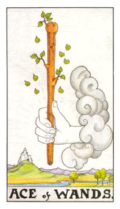
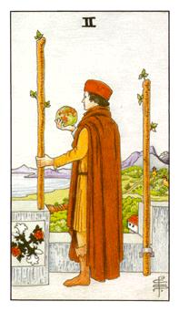
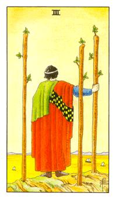
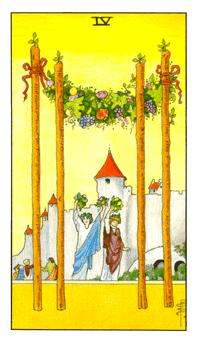
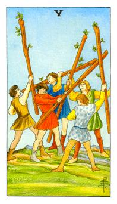
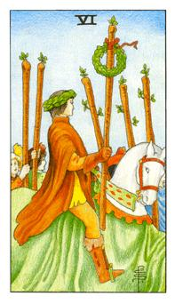
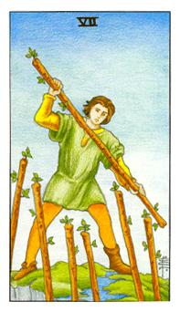
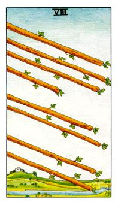
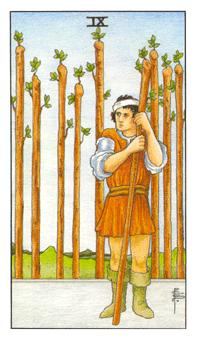
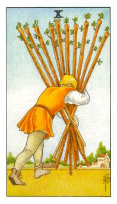

# 数字牌
火：侵略性、扩张性、急躁、奔放性、自然性

## 权杖Ace

无中生有，这张牌大于宫廷牌中的四张牌，落叶代表着上帝之子，代表新的生命新的契机，所有的机会点在这里产生，不预期的新方向。

所有的1都是无中生有，从左边出来称为阳，这只手又称为上帝之手，来自四面八方的机会，主张在于男性。问的是工作代表的是新的工作模式，而且不是环境原本有的，而是突然出现。不在预设范位之内，时间点到了就会出现。

逆位: 生育上面是有障碍的，突然而然的让事情无法成行。

## 权杖2

红玫瑰和白蔷薇，黄金黎民会的所在，守门者它是代表着第3阶，手拿着地球准备望外走，两个权杖一个在城堡一个要拿去外头，抉择，他将他在城堡内所看的书要做验证。生涯发展的抉择点。代表游历。

这个人接受的工作机会，他终于完成了，以他的记忆和谋略，这座建筑代表的是黄金梨明的圣殿，他是不是要继续往外走，他看着地球，他必须做ㄧ个决定，是往外走还是留下来。做出正确的取舍。

逆位: 优柔寡断，没被法去做抉择，进退维谷，该找出是什么原因动不了。所谓的进位两难。

## 权杖3

北欧的贸易商尼约特，代表远行，陆地上的工作已经完成，要往其他方面发展。

更代表工作上面，2只是离开城堡不代表会离开很远，3则是要离开很远，可能会跨海跨河，到远地方去发展。也有可能代表远距离恋爱。3也代表协调者，代表说他要往远的地方找。这里的工作已经饱和，必须到别的地方发展。代表当事人可能有更大的志向和计划要去发展，代表着北欧的尼芙特。

逆位: 工作没有完成，就会遇到同样的问题，必须完成现有工作才能进展，走不开的原因通常都是因为工作。

## 权杖4

短期内应该会订婚，4跟代表着4个月，另外有一套系统 ，这张牌代表着稳定，被大家认同，什么事情都非常好。

订婚，4是代表所有的稳定架构，正方形非常稳固，中间的人物代表荣耀和丰收，成果已经出来了。受到大家的欢迎。问男女的关系代表你们的关系受到大家的祝贺。初步基础已经完成，ㄧ种稳固的状态。

逆位: 之前的状态全部都被隔离掉，所有的基础都消失了，必须去重建。之前的成果全部都毁掉，代表工作上处理不顺遂。一切归零，从头开始。

## 权杖5

争斗，每个人谁都不让谁，每个人都想得到权力，团体中缺乏统合。在事物上会遇到很多的阻碍。

一个团队里面有太多意见，大家彼此都不愿意统合，必须常是去统合这些事情，做出对的选择。代表纷争和纷乱。

逆位: 从明斗变成暗斗，是很不安的，这时候要先撑住，要先抓住ㄧ个中心然后把事情慢慢处理完。不受到祝福的爱情，大家都反对。

## 权杖6

绿色代表荣耀，桂冠上面绑着凯尔特结，名声声望正在往上走，晋级变得更好，当事人正处在很兴旺的状态，又称为英雄者。

凯萨大帝回国图，晋级牌，升官的代表，因为他统合了纷乱。第六支权杖是荣耀的代表。

逆位: 名誉扫地，代表正在做不公不义的事情

## 权杖7

他需要具备勇气，又称为勇气牌，必须先做抵抗，而脚里面踩着两个大地，具备两种不同的思维，他是统合两块土地的想法，两种不同的文化。绿色代表着意志力的产生。炼金术中代表着外来的东西。

跨两条河的领域里面，代表她处境是有点尴尬的，没办法统合，她处境十分的危机，用ㄧ根棍子抵抗六根代表着是勇气。代表外来的环境对他都是不利的，他必须俱备勇气去面对这些挑战。

逆位: 人在屋簷下不的不低头，没办法抵抗，顺应时事，只能安份的忍耐待着，等待时机的出现，表现出当事人的无奈，时间点还没来到。必须要懂的应对进退。识时务者为俊杰。

## 权杖8

速行咒，凡是不可以等待快速进行，在你的积极状态下取得成果。

8根柱子全部往上冲，急速与快速，用最短的时间去完成他。积极度和快速度都在你手上，要尽快去完成。把主导权拉回身上，按照自己的步调走。最短的时间内快速的进行。

逆位: 进展到一半就突然被打断。

## 权杖9

路加福音，牧羊人在草原上牧羊，上帝化成老者，老者告诉她，我妻小有人得重病，我手上有一群羊，帮我代管三天，之后会给奖赏。代表着坚持、防御、能耐，只要坚持住就可以得到所要的。

上帝变成牧羊人，麻烦你帮我照顾羊，努力的去照顾，上帝变成狼，来陷害这个人，这个人坚持他所相信的，最后就会得到他所想的。或者是他坚持到临界点了，是否有用要看另ㄧ张的牌。本质就是现在所发生的事情要坚持下去。

逆位: 支持不下去，崩溃，散伙了，所有的东西都放下，选择放弃逃避不去变对，因为当事人的压力太大了，宝剑9代表的是精神上的压力，权杖则是行动上的关系，处理事情的能量到达临界点。管辖范围太大，导致他无法负荷。

## 权杖10

绝大的压力，不凡的状态，他看不见前面的事物，劝告当事人先把棍子放下，重新拟定方向，在扛起来向前走。

画面上的人扛着太多的事情，失去了自己的定位，他看不见前面的方向，身心灵俱疲的状态，这工作太繁忙，失去准心，一根根的往前面行动，代表着盲目。

逆位: 放松放下的状态
